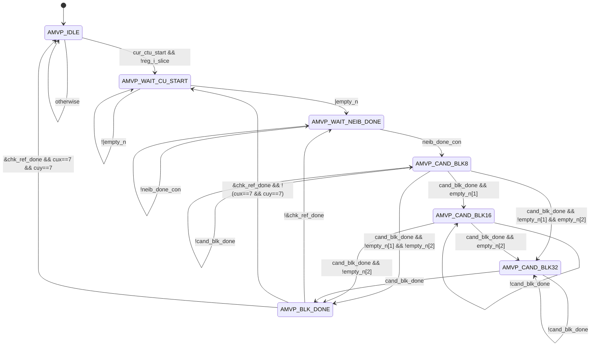
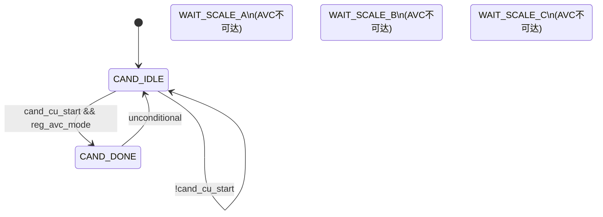
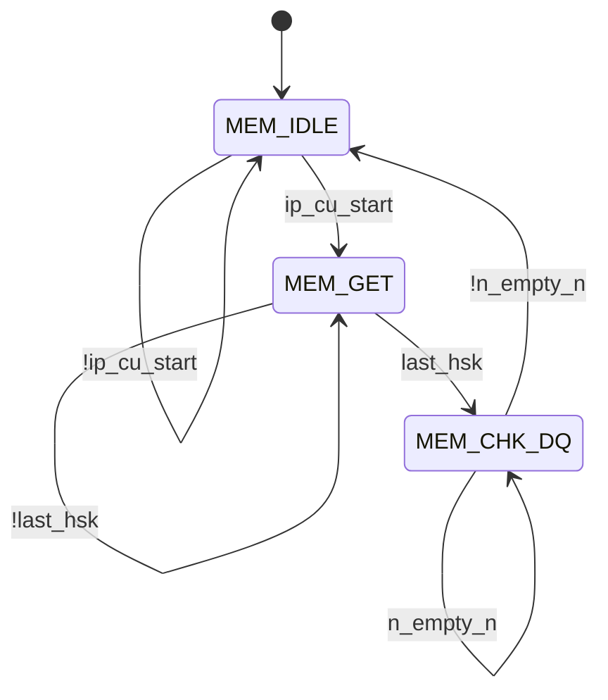
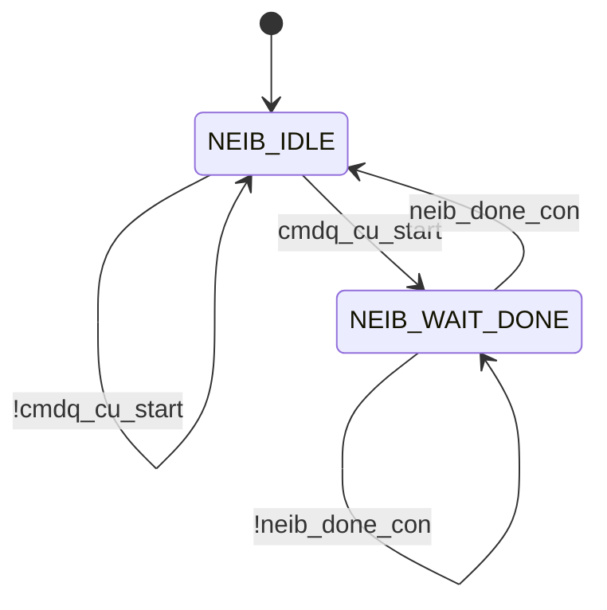

# AVC 模式解码侧 MVP 架构 Spec

## RTL 结论先行

| 项目 | RTL 结论 | 依据 |
|---|---|---|
| 编码/解码选择 | `codec_mode=1'b1` 为解码，`codec_mode=1'b0` 为编码 | `src_codec_dev/vc_mvp_top.v:81-91`；`src_codec_dev/vc_amvp_top.v:78-88` |
| AVC 模式选择 | `reg_avc_mode=1'b1` 为 AVC | `src_codec_dev/vc_mvp_top.v:81-84`；`src_codec_dev/vc_amvp_top.v:406` |
| AVC 解码基础使能 | `avc_dec_en = reg_avc_mode & codec_mode` | `src_codec_dev/vc_amvp_top.v:180-182,406` |
| 单笔命令实际接收 | `ccu2irpu_valid & irpu2ccu_rdy`；其中 `irpu2ccu_rdy` 还要求无在途事务、全部输入队列为空、分块顺序合法、`ref_idx` 合法、Skip/分块组合合法 | `src_codec_dev/vc_amvp_top.v:308-321` |
| 调度启动前提 | CTU 入口必须满足 `cur_ctu_start & ~reg_i_slice`。因此 AVC 解码运动路径预期只在非 I slice 工作；该条件没有直接并入 `irpu2ccu_rdy` | `src_codec_dev/vc_mvp_ctrl.v:282-286` |
| MVP 子系统顶层 | `vc_mvp_top` | `src_codec_dev/vc_mvp_top.v:8` |
| AVC 解码主处理顶层 | `vc_amvp_top` 实例 `U_VC_AMVP_TOP`；它负责 CCU 事务、候选汇合和 `final_mv` | `src_codec_dev/vc_mvp_top.v:469-567` |

本文只描述上述 `reg_avc_mode=1 && codec_mode=1` 数据通路。结论来自当前 RTL 的赋值、实例连接、握手和状态跳转；注释仅作辅助。默认顶层参数为 `NUM_REF=2`、`MAX_BLK_SZ=2`，即物理上只实例化 8×8/16×16 两级 AMVP 队列。

## 1. AVC 解码侧各细分模块功能

### 1.1 数据流总览

```text
CCU: valid/MVD/ref_idx/skip/partition
  → vc_mvp_top
  → vc_amvp_top.dec_transaction_reg
  → vc_mvp_ctrl：排队并调度邻居读取
  → vc_mvp_get_neib
      → 4 × vc_mvp_rd_mem（A、B、col、ref-list）
      → 外部邻居/同位/参考表存储器
      → CTU 内 A/B 运动信息缓存
  → vc_mvp_cand_gen
      → vc_mvp_cand_prior（仅少量共享选择关系仍可能影响 AVC）
      → AVC A/B/C 空域分量中值
  → vc_amvp_top：候选/MVD 上下文匹配
  → final_mv = selected_mvp + mvd
  → vc_mvp_top：复用 mrg2mc_* 接口发送到 MC
  → MC ack
  → vc_mvp_get_neib：回写已接受 final_mv，供后续分块使用
```

### 1.2 参与模块汇总

| 模块 | 文件路径 | AVC 解码侧核心功能 | 主要输入 | 主要输出 | 上下游关系 |
|---|---|---|---|---|---|
| `vc_mvp_top` | `src_codec_dev/vc_mvp_top.v` | 子系统顶层；选择解码 MC 输出；生成像素/分块坐标；在 MC 接受时回写邻居缓存 | 模式位、CCU 事务、CTU/CU 上下文、存储器响应、MC ack | `irpu2ccu_rdy`、`mrg2mc_*`、存储器请求 | CCU/MC/外部存储器与内部 AMVP、邻居管理器之间 |
| `vc_amvp_top` | `src_codec_dev/vc_amvp_top.v` | 一笔式 CCU 事务寄存；命令/候选/MVD 汇合；选中 AVC candidate 0；计算并保持 `final_mv` | CCU 事务、空域邻居、参考信息、MC 接受 | 调度命令、`dec_final_mv`、`dec_mv_valid`、事务上下文 | 上接 `vc_mvp_top`，下接控制器和候选生成器 |
| `vc_mvp_ctrl` | `src_codec_dev/vc_mvp_ctrl.v` | 每尺寸 1 深度命令 FIFO、参考索引遍历、邻居读取和候选生成调度 | 解码接受产生的 `ctrl_cur_cu_start`、坐标/可用性、邻居读完成、候选完成 | `cu_cmd_out`、`cur_ref_idx`、`neib_cu_start`、`cand_cu_start` | 位于 CCU 事务与邻居/候选引擎之间 |
| `vc_mvp_get_neib` | `src_codec_dev/vc_mvp_get_neib.v` | 发起 A/B/col/ref-list 读取；解析返回；按 AVC 位置映射 A0/A1/B0/B1/B2；维护 CTU 内已解码运动缓存 | AMVP 命令、外存响应、MC 接受后的 `final_mv` 更新 | `amvp_neib_a/b`、`amvp_col_c`、`reflist_info`、外存请求 | 给 `vc_mvp_cand_gen` 提供稳定邻居快照 |
| `vc_mvp_rd_mem` | `src_codec_dev/vc_mvp_rd_mem.v` | 可参数化请求序列器；请求元数据 FIFO 将延迟响应映射回正确槽位 | start、地址上下文、请求数、gnt、read-latency | req/address、返回槽位 one-hot、idle | 在 `vc_mvp_get_neib` 中实例化 4 次 |
| `vc_mvp_cand_gen` | `src_codec_dev/vc_mvp_cand_gen.v` | AVC 时从空域 A/B/C 计算 X/Y 独立中值；只产生 candidate 0；将候选连同参考元数据输出 | 命令、邻居、参考表、`reg_avc_mode` | `cand_mv[0]`、`cand_rdy[0]`、`cand_blk_done` | 上接邻居管理器，下接 `vc_amvp_top` 候选 FIFO |
| `vc_mvp_cand_prior` | `src_codec_dev/vc_mvp_cand_prior.v` | 共享的组合优先级逻辑。AVC 主中值分支绕过大部分 HEVC AMVP 规则，但“只有 A 侧有效”时 `cand_a[0]` 仍决定取 `neib_a[0]` 还是 `neib_a[1]` | 邻居可用、参考 POC/long-term、col 信息 | `cand_a/b/c` one-hot | 被 `vc_mvp_cand_gen` 实例化 |
| `sht_mdl` | `src_codec_dev` 中无定义 | 被用作命令、候选、MVD、AMVP-to-CCU 和请求元数据 FIFO | push/pop/data | full/empty/q | 当前目录只含实例；实际工程绑定版本需确认 |

### 1.3 `vc_mvp_top`

- `codec_mode` 在顶层直接选择 MC 数据源。解码时 `mrg2mc_cand_rdy/data/done` 来自 `dec_mrg2mc_*`；`mrg2mc_cand_nb` 和 `mrg2mc_cost_ack` 固定为 0，编码 Merge 代价路径不进入 AVC 解码输出，见 `vc_mvp_top.v:245-249`。
- `dec_part_mode=1` 使用 lane 0，尺寸字段为 8×8；`dec_part_mode=0` 使用 lane 1，尺寸字段为 16×16。`dec_mc_accept` 是对应 lane 的 `dec_mv_valid & mc2mrg_cand_ack`，见 `vc_mvp_top.v:251-273`。
- P8×8 子块坐标由 `sub_idx[0]` 增加 X、`sub_idx[1]` 增加 Y，每个增量为 8 pixel；CU 内坐标以 8 pixel 为单位，见 `vc_amvp_top.v:298-306`。
- MC 接受和邻居缓存更新是同一事件。解码时更新值为锁存的 `dec_final_mv/ref_idx/cu_x/cu_y`，见 `vc_mvp_top.v:275-283`。
- `g_reg_i_slice = reg_avc_mode | reg_i_slice` 被送入 `ve_mrg_top`。AVC 时该值恒为 1，Merge 控制器的命令 push 和 CTU 起动均要求 `~reg_i_slice`；同时其 MC ack/cost 输入在解码时固定为 0。因此 `ve_mrg_top` 是物理实例但不参与 AVC 解码结果，见 `vc_mvp_top.v:360,374-467`、`vc_mvp_ctrl.v:143,174,283,349`。
- 邻居管理器内部实际固定选择 `amvp_cu_start/amvp_cmd_out`，不是 Merge 命令，见 `vc_mvp_get_neib.v:239-243`。
- 顶层没有显式 FSM，只有输出 mux、坐标组合逻辑和 debug 采样寄存器。

### 1.4 `vc_amvp_top`

#### CCU 事务和分块

- `irpu2ccu_rdy` 的完整条件是：

  ```text
  reg_avc_mode
  && codec_mode
  && !dec_pending_q
  && !dec_mv_valid_q
  && all_queue_empty
  && !(|mv_empty_n)
  && dec_order_ok
  && dec_ref_idx_ok
  && dec_partition_ok
  ```

  对应 RTL 为 `vc_amvp_top.v:308-321,406,547-549`。

- `ref_idx` 输入为 4 bit，但接受条件要求 `[3:2]==0` 且 `[1:0] < NUM_REF`；内部只锁存低 2 bit，见 `vc_amvp_top.v:314-315,962-963`。
- `part_mode=0` 只允许 `sub_idx=0`，并排入 16×16 命令/MVD FIFO；`part_mode=1` 排入 8×8 队列并强制 `sub_idx` 按 0、1、2、3 raster 顺序。P8 序列还要求四笔事务的基础 `cur_cu_x/y` 不变，见 `vc_amvp_top.v:301-321,334-355,971-1000`。
- Skip 与 P8×8 的组合被拒绝，即当前 RTL 只允许非分块 Skip，见 `dec_partition_ok`（`vc_amvp_top.v:316`）。
- P8 后续子块会把内部已重建左邻/上邻的可用位强制为 1，见 `vc_amvp_top.v:342-350`。

#### 候选/MVD 汇合和 `final_mv`

- 接受 CCU 事务时，`{ref_idx[1:0], mvd_y[15:0], mvd_x[15:0]}` 写入相应尺寸的 MVD FIFO；相同内容也锁存在 `dec_mvd_q`，见 `vc_amvp_top.v:352-355,769-809,960-970`。
- 候选 FIFO 保存 `{cuy, cux, blk_size_onehot, candidate_record}`。弹出前同时核对：
  - 尺寸与 `dec_part_mode_q` 一致；
  - MVD FIFO 的 `ref_idx` 与事务一致；
  - 候选的 `cux/cuy/blk_size` 与锁存事务一致。

  见 `vc_amvp_top.v:408-441`。

- 默认 `NUM_REF=2` 时，解码会等待 reference 0 和 reference 1 的 candidate 0 槽都有效，再选择与当前 `ref_idx` 对应的槽，见 `vc_amvp_top.v:370-393,454-465`。
- AVC 解码没有 `mvp_idx` 输入，也不进行 candidate 0/1 代价比较。`cand_sel` 明确只在编码且非 AVC 时可能为 1；解码固定取 `sel_cand_0`，见 `vc_amvp_top.v:462-482`。
- 非 Skip：

  ```text
  final_mv_x = signed(selected_mvp_x) + signed(mvd_x)
  final_mv_y = signed(selected_mvp_y) + signed(mvd_y)
  ```

  加法为 17 bit signed，但寄存时只取 `[15:0]`。溢出仅在非综合代码中 `$warning`，没有饱和，见 `vc_amvp_top.v:464-469,984-987,1023-1028`。

- Skip 不使用输入 MVD，而使用 `avc_mvpxy`。若图像顶边/左边成立，或相应上/左可用邻居 MV 为 0，则 `avc_mvpxy` 整体为 0；否则使用 candidate 0 的 32-bit 中值 MV，见 `vc_amvp_top.v:576-578,982-987`。
- `dec_mv_valid_q` 是一项保持寄存器；在 MC ack 前，`final_mv` 和全部上下文保持不变，并有非综合稳定性检查，见 `vc_amvp_top.v:984-1003,1034-1054`。

#### 缓存/FIFO

- 每尺寸、每参考、每候选各有 1 深度的 52-bit 候选 FIFO。
- 8×8/16×16 各有一个 34-bit MVD FIFO，深度分别由 `FME_BLK8_CMDQ_DEPTH`/`FME_BLK16_CMDQ_DEPTH` 设置。
- 原有 `AMVP2CCU` FIFO 在 `avc_dec_en=1` 时 push/pop 均禁止；解码结果不走 `irpu_amvp_rdy/rd`，见 `vc_amvp_top.v:560-566,811-838`。
- 解码事务本身由 `dec_pending_q`、`dec_mv_valid_q` 和 P8 顺序寄存器控制，无显式编码 FSM。

### 1.5 `vc_mvp_ctrl`

- 每个尺寸的输入命令 FIFO 深度为 1，包格式为 14 bit，见 `vc_mvp_ctrl.v:115-130,245-270`。
- 解码接受时，`vc_amvp_top` 将 P8 命令转换为 `3'b001`，P16 命令转换为 `3'b010`；Skip 被强制作为普通候选生成命令处理，而不是被 AMVP push 条件过滤，见 `vc_amvp_top.v:334-340`。
- 控制器按参考索引循环，同一命令只在最后一个 active L0 reference 完成时 pop，见 `vc_mvp_ctrl.v:135-163,427-467`。
- AVC 时 B2 的图像右边界可用位在命令入队前被清零，见 `vc_mvp_ctrl.v:115-130`。
- 模块包含命令 FIFO、参考计数寄存器和 7-state one-hot FSM。

### 1.6 `vc_mvp_get_neib` 与 `vc_mvp_rd_mem`

- `vc_mvp_get_neib` 只用 AMVP 起动和 AMVP 命令；`reg_avc_mode` 用来选择 AMVP 的命令有效向量和 AVC 邻居位置映射，见 `vc_mvp_get_neib.v:239-256,510-523`。
- A/B 请求数由块尺寸、位置和可用性决定；奇数行/列的 8×8 块可以完全使用 CTU 内缓存而不发 A/B 请求，见 `vc_mvp_get_neib.v:391-411`。
- colocated 请求只在 `reg_tmp_mvp_flag=1` 时发起；reference list 仅在首 CTU、非 I slice 时由 `ctu0_start` 触发，见 `vc_mvp_get_neib.v:233,405-411,944-975`。
- `neib_done_con` 要求 A、B、col、ref 四个读取器均 idle；即使 AVC 中值不消费 temporal candidate，col/ref 读取仍可能成为调度等待条件，见 `vc_mvp_get_neib.v:413-426`。
- 外部每拍返回两个条目：
  - A/B 每条 34 bit：`{ref_idx[1:0], mvy[15:0], mvx[15:0]}`；
  - col 每条 42 bit：`{long, intra, poc_diff[7:0], mvy[15:0], mvx[15:0]}`；
  - ref 每条 33 bit：`{long, POC[31:0]}`。

  返回值按请求元数据写入 staging cache，见 `vc_mvp_get_neib.v:1046-1075`。

- `get_rd_neib_a/b` 把外存窗口转换为 A0/A1/B0/B1/B2；`get_neib_a/b` 再叠加当前 CTU 已解码块缓存，见 `vc_mvp_get_neib.v:561-610,716-838`。
- MC 接受后：
  - 8×8 更新对应的 A/B 局部缓存边；
  - 16×16 更新相邻两个槽；
  - 更新项为 `{ref_idx, final_mvy, final_mvx}`。

  见 `vc_mvp_top.v:275-283`、`vc_mvp_get_neib.v:1018-1040`。

### 1.7 `vc_mvp_cand_gen` 与 `vc_mvp_cand_prior`

- AVC 模式下，candidate FSM 在收到 `cand_cu_start` 时因 `reg_avc_mode` 直接从 `CAND_IDLE` 转 `CAND_DONE`；WAIT_SCALE 状态不参与结果生成，见 `vc_mvp_cand_gen.v:1117-1172`。
- AVC candidate 1 被强制清零，只有 candidate 0 有效，见 `vc_mvp_cand_gen.v:1234-1356,595-596`。
- 实际 AVC 空域输入为：
  - A：`neib_a[1]`；
  - B：`neib_b[1]`；
  - C：优先 `neib_b[0]`，否则 `neib_b[2]`。

  注意这里的 C 是 AVC 空域第三邻居，不是 `col_c` temporal 输入，见 `vc_mvp_cand_gen.v:420-465`。

- X、Y 各自用 signed 16-bit 比较器选中值。无邻居时输出 0；只有 B 或 C 时直接转发；只有 A 时由外层 UA 选择路径处理；其余组合进入三值中值逻辑，见 `vc_mvp_cand_gen.v:420-465,1238-1248`。
- AVC 空域中值本身不比较当前 `ref_idx`，且每个 active reference 均重复生成相同的 32-bit median；`cur_ref_idx` 主要影响候选元数据/槽位。该行为是 RTL 事实，是否满足系统预期需确认。
- `vc_mvp_cand_prior` 的 scaled、temporal 和多数 POC 优先级在 AVC 的 direct-median 分支不决定最终 MV；但“只有 A 有效”时 `cand_a[0]` 仍参与 A0/A1 选择，不能把整个模块视为完全无关，见 `vc_mvp_cand_prior.v:81-168`、`vc_mvp_cand_gen.v:350-360,1240-1247`。

### 1.8 明确旁路或不进入的逻辑

| 逻辑 | AVC 解码状态 | RTL 依据 |
|---|---|---|
| `ve_mrg_top` 候选/代价/FSM | 不参与；AVC 强制其 `reg_i_slice=1`，解码还屏蔽 MC ack/cost，输出由 decoder mux 覆盖 | `vc_mvp_top.v:360,374-467` |
| `vc_mvp_scale` temporal scaling | 结果不被 AVC candidate 选择；candidate FSM 直接去 DONE。共享 `scale_start` 组合逻辑可能仍产生无用切换，但不进入 `final_mv` | `vc_mvp_cand_gen.v:1117-1172,1238-1356,1512-1576` |
| temporal `col_c` candidate | 不进入 AVC median；但读取可能仍被发起并阻塞 `neib_done_con` | `vc_mvp_get_neib.v:409-418`；`vc_mvp_cand_gen.v:420-465` |
| candidate 1 和 MVD cost 比较 | candidate 1 被清零；`cand_sel` 只允许编码且非 AVC | `vc_mvp_cand_gen.v:1355`；`vc_amvp_top.v:475-489` |
| FME 接口 | `amvp2fme_cand_ack=0`、`irpu_amvp_dlat=0`；FME 不提供解码 MVD | `vc_amvp_top.v:395-403` |
| 原 `irpu_amvp_rdy/rd` CCU FIFO | 解码 push/pop 禁止 | `vc_amvp_top.v:560-566` |
| Merge cost 接口 | `mrg2mc_cost_ack=0`，输入 cost 不参与 decoder mux | `vc_mvp_top.v:245-249,432-434` |
| L1/双向预测 | 未进入实现；`reg_num_ref_l1_act_m1`、`reg_col_l0_flag` 未被 AVC 解码数据通路使用，只有 L0 active-reference 计数参与调度 | `vc_mvp_top.v:69-75`；全目录引用关系 |

## 2. AVC 解码侧 MVP 接口信息

下表位宽以顶层默认参数 `VC_PIC_X_NB=VC_PIC_Y_NB=12`、`NUM_REF=2`、`MAX_BLK_SZ=2` 为主；参数化项单独标出。

### 2.1 顶层及关键内部信号

| 信号 | 方向 | 位宽 | Signed 属性 | 来源 | 去向 | AVC 解码有效条件 | 功能 |
|---|---|---:|---|---|---|---|---|
| `codec_mode` | input | 1 | unsigned | 系统配置 | 顶层 mux、`vc_amvp_top` | `1` | 选择解码 |
| `reg_avc_mode` | input | 1 | unsigned | 寄存器配置 | AMVP/邻居/候选 | `1` | 选择 AVC |
| `ccu2irpu_valid` | input | 1 | unsigned | CCU | `vc_amvp_top` | `avc_dec_en && irpu2ccu_rdy` | CCU 命令 valid |
| `irpu2ccu_rdy` | output | 1 | unsigned | `vc_amvp_top` | CCU | 见完整 ready 表达式 | CCU 命令 ready |
| `ccu2irpu_mvd[0]` | input | 16 | 数据按 signed 使用 | CCU | `dec_mvd_q[0]`、MVD FIFO | `dec_accept` | X 分量 MVD |
| `ccu2irpu_mvd[1]` | input | 16 | 数据按 signed 使用 | CCU | `dec_mvd_q[1]`、MVD FIFO | `dec_accept` | Y 分量 MVD |
| `ccu2irpu_ref_idx` | input | 4 | unsigned | CCU | 合法性检查、内部低 2 bit | `dec_accept` 且 `[3:2]=0`、低位 `<NUM_REF` | L0 参考索引 |
| `ccu2irpu_is_skip` | input | 1 | unsigned | CCU | 事务寄存器 | `dec_accept`；不能与 P8 同时为 1 | 选择 P_Skip final-MV 路径 |
| `ccu2irpu_part_mode` | input | 1 | unsigned | CCU | 尺寸/坐标/MC lane | `dec_accept` | `0`:16×16，`1`:P8×8 |
| `ccu2irpu_sub_idx` | input | 2 | unsigned | CCU | P8 顺序/坐标 | P16 必须 0；P8 必须 0→1→2→3 | 8×8 子块序号 |
| `cur_ctu_start` | input | 1 | unsigned | CTU 控制 | `vc_mvp_ctrl`、ref-list reader | `~reg_i_slice` | 起动该 CTU 的 MVP 调度 |
| `cur_cu_x/y` | input | 各 3 | unsigned | CU 控制 | 解码坐标生成 | `dec_accept` | 以 8 pixel 为单位的 CTU 内基础坐标 |
| `cur_cu_a_avail` | input | `3×2` | unsigned | CU 控制 | 命令包 | 接受对应尺寸事务 | A0/A1 可用性 |
| `cur_cu_b_avail` | input | `3×3` | unsigned | CU 控制 | 命令包 | 接受对应尺寸事务 | B0/B1/B2 可用性 |
| `reg_num_ref_l0_act_m1` | input | 4 | unsigned | slice 配置 | 调度器、ref reader | 非 I slice | active L0 数量减 1 |
| `reg_tmp_mvp_flag` | input | 1 | unsigned | slice 配置 | col reader、候选共享逻辑 | 为 1 时会读 col | temporal 读取使能；不进入 AVC median MV |
| `irpu2neib_a_req/addr` | output | `1/2` | unsigned | `vc_mvp_rd_mem(A)` | 外部 A memory | A 请求数非 0 | A 邻居读请求 |
| `irpu2neib_b_req/addr` | output | `1/5` | unsigned | `vc_mvp_rd_mem(B)` | 外部 B memory | B 请求数非 0 | B 邻居读请求 |
| `irpu2col_req/addr` | output | `1/5` | unsigned | `vc_mvp_rd_mem(col)` | 外部 col memory | `reg_tmp_mvp_flag` | 同位信息读取；AVC final MV 不消费 |
| `irpu2ref_req/addr` | output | `1/(4+VC_EN_BI_DIR)` | unsigned | `vc_mvp_rd_mem(ref)` | 外部 ref memory | 首 CTU、非 I slice | L0 reference POC/long-term 读取 |
| `dec_pending_q` | internal reg | 1 | unsigned | `dec_accept` | 上下文匹配 | `avc_dec_en` | 已接收、等待候选/MC |
| `dec_mv_valid_q` | internal reg | 1 | unsigned | `dec_result_fire` | MC mux | 等待对应 MC ack | reconstructed MV 有效/保持 |
| `selected_mvp_x/y` | internal wire | 各 16 | signed | candidate 0 | 17-bit 加法器 | 非 Skip 结果生成 | 选中的 AVC MVP |
| `dec_mv_x_sum/y_sum` | internal wire | 各 17 | signed | MVP + MVD | `dec_final_mv_q` | `dec_result_fire && !skip` | 未截断和 |
| `dec_final_mv[0/1]` | internal output | `2×16` | 数据按 signed 使用 | `dec_final_mv_q` | 顶层 MC mux、邻居回写 | `dec_mv_valid` | X/Y 最终 MV |
| `mrg2mc_cand_rdy` | output | 3 | unsigned | decoder output mux | MC | 解码且 `dec_mv_valid` | lane0=P8、lane1=P16、lane2=0 |
| `mc2mrg_cand_ack` | input | 3 | unsigned | MC | decoder accept logic | 对应 lane ready | MC 接受 |
| `mrg2mc_cand_done` | output | 3 | unsigned | decoder output mux | MC | 与对应 `rdy&ack` 同拍 | 接受完成脉冲 |

### 2.2 完整改名映射

```text
codec_mode
  → vc_mvp_top.codec_mode
  → U_VC_AMVP_TOP.codec_mode
  → avc_dec_en = reg_avc_mode & codec_mode
```

```text
CCU ccu2irpu_valid/MVD/ref_idx/is_skip/part_mode/sub_idx
  → vc_mvp_top 同名端口
  → U_VC_AMVP_TOP 同名端口
  → dec_accept
  → dec_*_q + mv_fifo_d
```

```text
cur_cu_a/b_avail
  → ctrl_cur_cu_a/b_avail（P8 内部邻居可用性修正）
  → U_VC_AMVP_CTRL.cur_cu_a/b_avail
  → 14-bit cu_cmdq_in
  → cu_cmd_out
  → cu_cmd_out_sel（前置 3-bit block-size one-hot）
  → U_VC_AMVP_CAND_GEN.cu_cmd_out
```

```text
外部 neib_a/b/col/ref 返回
  → vc_mvp_get_neib staging registers
  → amvp_neib_a/b、amvp_col_c、reflist_info
  → vc_mvp_cand_gen
  → cand_mv[0]
  → vc_amvp_top.cand_d/cand_q
  → sel_cand_0
  → selected_mvp_x/y
```

```text
selected_mvp + dec_mvd_q
  → dec_mv_x_sum/dec_mv_y_sum
  → dec_final_mv_q
  → vc_mvp_top.dec_final_mv
  → dec_mrg2mc_cand_data
  → mrg2mc_cand_data
  → MC
```

```text
MC mc2mrg_cand_ack
  → dec_mc_accept
  → 清除 dec_pending_q/dec_mv_valid_q
  → neib_cur_cu_upd
  → vc_mvp_get_neib.cur_cu_upd
  → a_0_reg/b_0_reg
```

### 2.3 打包总线字段

#### 14-bit CU command

| Bit 范围 | 字段 | 位宽 | 含义 | 生成位置 | AVC 解码使用位置 |
|---|---|---:|---|---|---|
| `[2:0]` | `cux` | 3 | CTU 内 8-pixel 单位 X | `vc_mvp_ctrl.v:122-130` | 邻居地址、候选上下文 |
| `[5:3]` | `cuy` | 3 | CTU 内 8-pixel 单位 Y | 同上 | 邻居地址、候选上下文 |
| `[8:6]` | B avail | 3 | B0/B1/B2 可用；AVC 右边界可清 B2 | 同上 | 邻居读和 median |
| `[10:9]` | A avail | 2 | A0/A1 可用 | 同上 | 邻居读和 median |
| `[11]` | ZMV | 1 | 原编码侧零运动标志 | 同上 | 解码命令路径不用于 `final_mv` |
| `[12]` | Skip | 1 | 原命令 Skip 位 | 同上 | 解码送控制器时被强制为 0；实际 Skip 保存在 `dec_is_skip_q` |
| `[13]` | terminate | 1 | 原编码侧终止标志 | 同上 | 解码 CCU 事务不生成 terminate |

候选生成器前再拼接 `[16:14]=block_size_onehot`，其中 bit 14/15/16 分别表示 8/16/32，见 `vc_amvp_top.v:289-291`。

#### 43-bit candidate record

| Bit 范围 | 字段 | 位宽 | 含义 | 生成位置 | AVC 解码使用位置 |
|---|---|---:|---|---|---|
| `[15:0]` | `mvx` | 16 | candidate X | `vc_mvp_cand_gen.v:347-360` | `selected_mvp_x` |
| `[31:16]` | `mvy` | 16 | candidate Y | 同上 | `selected_mvp_y` |
| `[33:32]` | `ref_idx` | 2 | 候选参考索引 | 同上 | 解码不比较该字段；按 FIFO 槽选 reference |
| `[41:34]` | `poc_diff` | 8 | 当前参考 POC 差 | `vc_mvp_cand_gen.v:373-393` | `final_mv` 不消费 |
| `[42]` | `long_term` | 1 | long-term 标志 | `vc_mvp_cand_gen.v:395-417` | `final_mv` 不消费 |

#### 52-bit candidate FIFO record

| Bit 范围 | 字段 | 位宽 | 含义 | 生成位置 | AVC 解码使用位置 |
|---|---|---:|---|---|---|
| `[42:0]` | candidate record | 43 | 上表候选 | `vc_amvp_top.v:408-418` | candidate 0 MV |
| `[45:43]` | block size | 3 | 8/16/32 one-hot | 同上 | `dec_context_match` |
| `[48:46]` | `cux` | 3 | 候选上下文 X | 同上 | `dec_context_match` |
| `[51:49]` | `cuy` | 3 | 候选上下文 Y | 同上 | `dec_context_match` |

#### 34-bit decoder MVD FIFO record

| Bit 范围 | 字段 | 位宽 | 含义 | 生成位置 | AVC 解码使用位置 |
|---|---|---:|---|---|---|
| `[15:0]` | `mvd_x` | 16 | X MVD | `vc_amvp_top.v:352-355` | 队列汇合；加法实际用 `dec_mvd_q` |
| `[31:16]` | `mvd_y` | 16 | Y MVD | 同上 | 同上 |
| `[33:32]` | `ref_idx` | 2 | L0 reference | 同上 | `dec_context_match` |

#### `mrg2mc_cand_data` decoder record

默认宽度为 `MRG2MC_DW=VC_PIC_X_NB+VC_PIC_Y_NB+39`。

| Bit 范围（默认 63 bit） | 字段 | 位宽 | 含义 |
|---|---|---:|---|
| `[31:0]` | `{mvy,mvx}` | 32 | 最终 MV |
| `[33:32]` | `ref_idx` | 2 | L0 reference |
| `[35:34]` | size 1 | 2 | decoder lane0 为 `1`、lane1 为 `2` |
| `[37:36]` | size 2 | 2 | decoder lane0 为 `1`、lane1 为 `2` |
| `[49:38]` | `pic_x` | 12 | 当前分块像素 X |
| `[61:50]` | `pic_y` | 12 | 当前分块像素 Y |
| `[62]` | 固定 `1` | 1 | 原 packed 接口高位标志；精确协议名称在本目录无定义，**待确认** |

实际拼接见 `vc_mvp_top.v:262-271`。两个 size 字段在当前 decoder 输出中总是相同；其协议名称依据顶层参数注释推测为水平/垂直尺寸，但哪个字段对应 H/V，**待确认**。

### 2.4 未连接、固定值和仅编码/HEVC 使用接口

- `reg_num_ref_l1_act_m1` 在 `vc_mvp_top` 声明但未接入 AVC 解码子模块。
- `reg_col_l0_flag` 虽向 AMVP/Merge 传递，但 `vc_amvp_top` 内没有实际使用。
- `ccu2irpu_mvp_idx` 不存在；AVC 解码固定 candidate 0。
- `mrg2mc_cand_nb=0`、`mrg2mc_cost_ack=0`；`mc2mrg_cost_rdy/data` 不影响 decoder result。
- `irpu_amvp_rdy/rd` 和 `irpu_mrg_rdy/rd` 是保留的编码/旧 CCU 输出接口，不承载本解码 `final_mv`。
- `fme2amvp_*` 在 AVC 解码被禁止。
- lane 2/32×32 在默认 `MAX_BLK_SZ=2` 的 AMVP 中固定无效。

## 3. AVC 解码侧 FSM Transition

### 3.1 `vc_mvp_ctrl`：AMVP 主调度 FSM

状态寄存器为 `fsm_mvp_cs[6:0]`，one-hot；复位和 `reg_slice_go` 后赋值 `7'b0000001`，即 `AMVP_IDLE`，见 `vc_mvp_ctrl.v:63-69,474-483`。

| 当前状态 | 编码/one-hot | AVC 解码侧跳转条件 | 下一状态 | 主要操作 | 相关接口信号 |
|---|---:|---|---|---|---|
| `AMVP_IDLE` | bit0 / `0000001` | `cur_ctu_start & ~reg_i_slice` | `AMVP_WAIT_CU_START` | 打开该 CTU 调度 | `cur_ctu_start`, `reg_i_slice` |
| `AMVP_IDLE` | 同上 | 否则 | 自循环 | 空闲 | — |
| `AMVP_WAIT_CU_START` | bit1 / `0000010` | `|empty_n` | `AMVP_WAIT_NEIB_DONE` | 检测到 CCU 接受后入队的 8/16 命令；发 `neib_cu_start` | `empty_n`, `neib_cu_start` |
| `AMVP_WAIT_CU_START` | 同上 | 无命令 | 自循环 | 等待命令 | `ccu2irpu_valid/rdy` 间接驱动 FIFO |
| `AMVP_WAIT_NEIB_DONE` | bit2 / `0000100` | `neib_done_con` | `AMVP_CAND_BLK8` | 等 A/B/col/ref reader idle | `neib_done_con` |
| `AMVP_WAIT_NEIB_DONE` | 同上 | 未完成 | 自循环 | 等待存储器握手/响应 | req/gnt/read-latency |
| `AMVP_CAND_BLK8` | bit3 / `0001000` | `cand_blk_done && empty_n[1]` | `AMVP_CAND_BLK16` | 产生 8×8 候选后处理 16×16 队列 | `cand_cu_start`, `cand_blk_done` |
| `AMVP_CAND_BLK8` | 同上 | `cand_blk_done && !empty_n[1] && !empty_n[2]` | `AMVP_BLK_DONE` | 完成当前尺寸 | 同上 |
| `AMVP_CAND_BLK8` | 同上 | 未完成 | 自循环 | 候选生成 | 同上 |
| `AMVP_CAND_BLK16` | bit4 / `0010000` | `cand_blk_done`；默认 `empty_n[2]=0` | `AMVP_BLK_DONE` | 产生 16×16 候选 | 同上 |
| `AMVP_CAND_BLK32` | bit5 / `0100000` | `cand_blk_done` | `AMVP_BLK_DONE` | 32×32 候选 | 默认 `MAX_BLK_SZ=2` 不会进入 |
| `AMVP_BLK_DONE` | bit6 / `1000000` | `&chk_ref_done && cux==7 && cuy==7` | `AMVP_IDLE` | CTU 最后位置完成 | ref counters、命令坐标 |
| `AMVP_BLK_DONE` | 同上 | `&chk_ref_done` 且非 CTU 最后位置 | `AMVP_WAIT_CU_START` | 等下一 CU 命令 | `empty_n` |
| `AMVP_BLK_DONE` | 同上 | 尚有 reference 未处理 | `AMVP_WAIT_NEIB_DONE` | 同一命令进入下一 reference | `ref_idx`, `neib_cu_start` |



#### 16×16 路径的关键疑似死锁

当前 decoder 对 P16 只 push `ctrl_cur_cu_start=3'b010`，但 FSM 在邻居读完后无条件先进入 `AMVP_CAND_BLK8`：

1. `vc_amvp_top.v:334-336`：P16 只排入尺寸 1；
2. `vc_mvp_ctrl.v:294-310`：无条件 `WAIT_NEIB_DONE → CAND_BLK8`；
3. `vc_mvp_ctrl.v:199-200`：在 `CAND_BLK8` 会拉高 `cand_cu_start`；
4. `vc_amvp_top.v:408-418`：活动的 block-size one-hot 会把候选 push 到 8×8 candidate FIFO；
5. 该假 8×8 candidate 没有匹配的 8×8 MVD，不能由 decoder `cand_pop[0]` 清除；
6. `all_queue_empty` 包含全部 `cand_empty_n`，下一笔 `irpu2ccu_rdy` 因此不能再拉高，见 `vc_amvp_top.v:547-549,317-320`。

若工程绑定的 `sht_mdl` 采用本 workspace `src_encoder_ref/sht_mdl.v` 所示 occupancy 语义，则该条目会保持有效直至 pop。由当前 RTL 可推得：第一笔 P16 可能产生并送出结果，但之后 decoder ready 可能永久被残留 8×8 candidate 阻塞。此项属于 **疑似实现缺陷，必须确认/修复**。

### 3.2 `vc_mvp_cand_gen`：候选 FSM

状态寄存器 `fsm_cand_cs[4:0]` 为 one-hot。状态常量是 bit index，而非顺序编码；复位/`reg_slice_go` 后为 `CAND_IDLE`，见 `vc_mvp_cand_gen.v:63-67,1593-1602`。

| 当前状态 | 编码/one-hot | AVC 解码侧跳转条件 | 下一状态 | 主要操作 | 相关接口信号 |
|---|---:|---|---|---|---|
| `CAND_IDLE` | bit0 / `00001` | `cand_cu_start && reg_avc_mode` | `CAND_DONE` | 组合计算 AVC median；`cand_rdy[0]` 可同拍有效 | `cand_cu_start`, `cand_mv[0]`, `cand_rdy[0]` |
| `CAND_IDLE` | 同上 | 无 start | 自循环 | 空闲 | — |
| `CAND_DONE` | bit2 / `00100` | 无条件 | `CAND_IDLE` | `cand_blk_done=1` | `cand_blk_done` |
| `CAND_WAIT_SCALE_C` | bit1 / `00010` | — | — | AVC 正常入口不可达 | scale 接口 |
| `CAND_WAIT_SCALE_A` | bit3 / `01000` | — | — | AVC 正常入口不可达 | scale 接口 |
| `CAND_WAIT_SCALE_B` | bit4 / `10000` | — | — | AVC 正常入口不可达 | scale 接口 |



### 3.3 `vc_mvp_rd_mem`：四个读取器的共享 FSM

`fsm_mem_cs[2:0]` one-hot，复位/`reg_slice_go` 后为 `MEM_IDLE`。A、B、col、ref-list 四个实例使用相同状态机，区别仅在 start、请求数量、地址和返回 metadata，见 `vc_mvp_rd_mem.v:48-50,239-298`。

| 当前状态 | 编码/one-hot | AVC 解码侧跳转条件 | 下一状态 | 主要操作 | 相关接口信号 |
|---|---:|---|---|---|---|
| `MEM_IDLE` | bit0 / `001` | `ip_cu_start` | `MEM_GET` | 发第一笔 req | `ip2mem_req`, `mem2ip_gnt` |
| `MEM_IDLE` | 同上 | 无 start | 自循环 | idle | `rd_mem_idle=1` |
| `MEM_GET` | bit1 / `010` | `last_hsk` | `MEM_CHK_DQ` | 最后一笔请求被 grant | req/gnt、`mem_cnt` |
| `MEM_GET` | 同上 | 非最后一次 | 自循环 | 继续发地址并把目的槽 metadata push 入 FIFO | `ip2mem_addr`, metadata FIFO |
| `MEM_CHK_DQ` | bit2 / `100` | `!n_empty_n` | `MEM_IDLE` | 所有延迟响应及 metadata 已排空 | `mem2ip_rd_lat`, FIFO pop |
| `MEM_CHK_DQ` | 同上 | 尚有响应 | 自循环 | 等待返回 | `mem2ip_rd_lat` |



实例 start 条件：

| 实例 | start | AVC 数据相关性 |
|---|---|---|
| `U_GET_NEIB_A` | `cmdq_cu_start & |a_avail_cnt` | 直接提供 A 邻居 |
| `U_GET_NEIB_B` | `cmdq_cu_start & |b_avail_cnt` | 直接提供 B/C 空域邻居 |
| `U_GET_NEIB_C` | `cmdq_cu_start & reg_tmp_mvp_flag` | 读取会影响完成时刻，但返回 MV 不进 AVC median |
| `U_GET_REFLIST` | `cur_ctu_start & !reg_i_slice & ctux==0 & ctuy==0` | 候选元数据/共享组合逻辑使用；`final_mv` 只消费 candidate MV |

### 3.4 `vc_mvp_get_neib`：完成跟踪 FSM

`fsm_neib_cs[1:0]` 为 one-hot，复位/`reg_slice_go` 后为 `NEIB_IDLE`，见 `vc_mvp_get_neib.v:113-114,980-996,1078-1088`。

| 当前状态 | 编码 | AVC 解码侧跳转条件 | 下一状态 | 主要操作 | 相关接口信号 |
|---|---:|---|---|---|---|
| `NEIB_IDLE` | bit0 / `01` | `cmdq_cu_start` | `NEIB_WAIT_DONE` | 跟踪一次 AMVP 邻居读取 | `amvp_cu_start` |
| `NEIB_IDLE` | 同上 | 无 start | 自循环 | 空闲 | — |
| `NEIB_WAIT_DONE` | bit1 / `10` | `neib_done_con` | `NEIB_IDLE` | 四类 reader 均 idle | `get_neib_*_idle` |
| `NEIB_WAIT_DONE` | 同上 | 未完成 | 自循环 | 等待 | req/gnt/read-latency |



该 FSM 的状态没有参与 `neib_done_amvp` 或请求使能；`neib_done_amvp` 直接等于组合信号 `neib_done_con`。因此它是显式存在的完成跟踪 FSM，但不是实际门控点，见 `vc_mvp_get_neib.v:413-426`。

### 3.5 无显式 FSM和不属于 AVC 解码的 FSM

- `vc_amvp_top` decoder transaction：**无显式 FSM**。实际控制是：

  ```text
  EMPTY
    -- dec_accept --> dec_pending_q=1
    -- dec_result_fire --> dec_mv_valid_q=1
    -- dec_mc_accept --> dec_pending_q=0, dec_mv_valid_q=0
  ```

  `dec_mv_valid_q` 可与 `dec_pending_q` 同时为 1，直到 MC 接受。

- `vc_mvp_top`：**无显式 FSM**；解码输出由组合 mux 和 MC ack 控制。
- `vc_mvp_cand_prior`：**无显式 FSM**；全组合 one-hot 选择。
- `vc_mvp_scale.fsm_mulcyc_cs`：显式两状态 FSM，但 AVC candidate 路径不等待或消费 `scale_done/scale_mv`，不属于有效 AVC 解码控制。
- `vc_amvp_top.fsm_term_cs`：终止/flush FSM 的 `AMVP2CCU` push 在 `avc_dec_en` 时被禁止，不控制 decoder `final_mv`。
- `ve_mrg_top` 内所有 Merge、MC cost、MV gain、termination FSM：AVC 解码时被 `g_reg_i_slice=1`、固定 ack/cost 和顶层 decoder output mux 旁路。

## 关键未实现项、疑似缺陷和待确认项

1. **P16 后续事务疑似死锁**：主调度器无条件先生成 BLK8 candidate，留下无 MVD 匹配的 8×8 candidate FIFO 项；详见 3.1。
2. **分块覆盖不完整**：CCU 接口只编码 P16×16 和 P8×8；未见 P16×8、P8×16、P8 子分块 8×4/4×8/4×4。
3. **只有 L0、默认最多两个 reference 的有效实现**：L1 数量和方向信号未进入解码数据通路；candidate 槽选择使用 `dec_ref_idx_q[0]*NUM_REF` 和 `fme_ref_idx` 单 bit。若把 `NUM_REF` 参数设为大于 2，索引行为不完整，需确认。
4. **无 decoder `mvp_idx`**：固定使用 candidate 0。对当前“单一 AVC median”设计可自洽，但若 CCU 协议预期携带索引则尚未实现。
5. **`final_mv` 无饱和**：17-bit signed 和直接截成 16 bit；只在仿真警告溢出。
6. **AVC median 不按当前 `ref_idx` 改变**：相同空域中值为每个 active reference 重复生成；是否符合系统的 AVC 预测规则预期，**待确认**。
7. **I slice 接口防护不闭合**：调度器要求 `~reg_i_slice`，但 `irpu2ccu_rdy` 未检查 `reg_i_slice`。系统必须保证 I slice 不发送 CCU motion 事务，否则可接收后不被调度。
8. **col/ref 冗余依赖**：AVC final MV 不使用 temporal candidate 或 candidate 的 POC/long-term 字段，但共享完成条件仍可能等待 col/ref 读取。
9. **外部 primitive 绑定待确认**：`sht_mdl`、`ve_irpu_expg_bits` 和 `ve_defines.v` 不在 `src_codec_dev`；本目录无法独立编译并确认最终绑定版本。
10. **MC packed 协议两个 size 字段的 H/V 命名以及最高位标志语义**：拼接和值可由 RTL确认，协议名称在本目录无定义，**待确认**。
