# MVP Internal Blocks Hardware Architecture Specification

> RTL 基线：`src_codec_dev/*.v`（9 个文件）  
> 外部工具依赖：`src_encoder_ref/sht_mdl.v`、`src_encoder_ref/ve_irpu_expg_bits.v`  
> 参考文档形式：《参考.pdf》中“架构图 → 模块 → 接口 → FSM → 分尺寸模块”的章节组织  
> 生成日期：2026-07-30

## 0. 范围、证据与术语

本文只把活动 RTL 的端口、组合赋值、时序赋值、generate 条件和例化连接作为功能证据。模块名与注释用于定位代码，不单独作为结论依据。无法由这些代码确认的系统级含义标为 **TBD**。

本文使用 **PU8、PU16、PU32**，分别指 RTL 的 8×8、16×16、32×32 block-size 通道：

| 文档术语 | RTL 尺寸位 | 命令入口 | 默认支持 |
|---|---:|---|---|
| PU8 | bit 0 | `cur_cu_start[0]` | Merge、AMVP、AVC decoder |
| PU16 | bit 1 | `cur_cu_start[1]` | Merge、AMVP、AVC decoder |
| PU32 | bit 2 | `cur_cu_start[2]` | Merge；默认 AMVP 不展开 |

上述映射由 `vc_mvp_ctrl` 中 `cu_blk_en[0/1/2]` 对 `CAND_BLK8/16/32` 的直接赋值确认。PU 在上层协议中的完整语义不在本目录定义，除尺寸外均为 **TBD**。  
【RTL：`src_codec_dev/vc_mvp_ctrl.v::vc_mvp_ctrl`, L63-L69, L108-L110】

### 0.1 默认参数基线

接口宽度和“默认支持”以 `vc_mvp_top` 默认参数为基线：

| 参数 | 默认值 | 派生值 |
|---|---:|---:|
| `VC_PIC_X_NB` / `VC_PIC_Y_NB` | 12 / 12 | — |
| `VC_CTU_X_NB` / `VC_CTU_Y_NB` | 7 / 7 | — |
| `VC_CU_X_NB` / `VC_CU_Y_NB` | 9 / 9 | — |
| `NUM_REF` | 2 | `MUL_REF=1` |
| `VC_EN_BI_DIR` | 0 | ref address = 4 bit |
| `MAX_BLK_SZ` | 2 | AMVP 为 PU8/PU16 |
| `MVP_SCALE_EN` | 1 | 两个候选生成器均例化 scaler |
| `VC_SATD_NB` / `VC_SSE_NB` | 16 / 26 | `VC_MRG_NB=42` |
| `MRG2MC_DW` | 表达式 | 63 bit/lane |
| `MRG2CCU_DW` | 表达式 | 106 bit/lane |
| `AMVP2CCU_DW` | 86 | 86 bit/lane |

`ve_mrg_top` 在 `vc_mvp_top` 中被固定为 `MAX_BLK_SZ=3`，因此 Merge 始终展开 PU8/PU16/PU32；`vc_amvp_top` 使用顶层 `MAX_BLK_SZ`，默认只展开 PU8/PU16。  
【RTL：`src_codec_dev/vc_mvp_top.v::vc_mvp_top`, L9-L29, L374-L390, L469-L483】

# 1. MVP 架构

## 1.1 总体架构

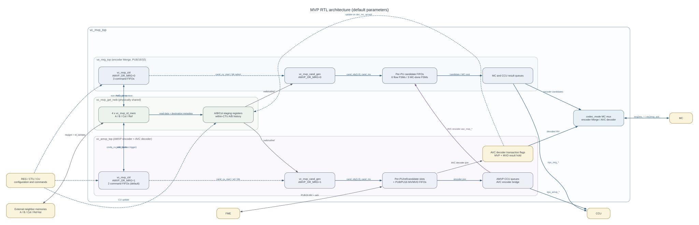

DOT 源码：[`figures/mvp_arch.dot`](figures/mvp_arch.dot)

### 1.1.1 模块层级

```text
vc_mvp_top
├─ U_VE_MRG_TOP : ve_mrg_top
│  ├─ U_VC_MRG_CTRL : vc_mvp_ctrl (AMVP_OR_MRG=0, MAX_BLK_SZ=3)
│  │  └─ ccu_cmdq[0:2] : sht_mdl
│  ├─ U_VC_MRG_CAND_GEN : vc_mvp_cand_gen (AMVP_OR_MRG=0)
│  │  ├─ U_VC_MVP_CAND_PRIOR : vc_mvp_cand_prior
│  │  └─ U_VC_SCALE_CAL : vc_mvp_scale (MVP_SCALE_EN=1)
│  ├─ 6 × candidate FIFO : sht_mdl
│  └─ 3 × Merge-to-CCU FIFO : sht_mdl
├─ U_VC_AMVP_TOP : vc_amvp_top
│  ├─ U_VC_AMVP_CTRL : vc_mvp_ctrl (AMVP_OR_MRG=1, MAX_BLK_SZ=2 default)
│  │  └─ ccu_cmdq[0:1] : sht_mdl
│  ├─ U_VC_AMVP_CAND_GEN : vc_mvp_cand_gen (AMVP_OR_MRG=1)
│  │  ├─ U_VC_MVP_CAND_PRIOR : vc_mvp_cand_prior
│  │  └─ U_VC_SCALE_CAL : vc_mvp_scale (MVP_SCALE_EN=1)
│  ├─ per-PU/ref/candidate rendezvous FIFO : sht_mdl
│  ├─ PU8 / PU16 MV-or-MVD FIFO : sht_mdl
│  ├─ PU8 / PU16 AMVP-to-CCU FIFO : sht_mdl
│  └─ 4 × ve_irpu_expg_bits
└─ U_VC_MVP_GET_NEIB : vc_mvp_get_neib
   ├─ U_GET_NEIB_A : vc_mvp_rd_mem
   │  └─ metadata FIFO : sht_mdl
   ├─ U_GET_NEIB_B : vc_mvp_rd_mem
   │  └─ metadata FIFO : sht_mdl
   ├─ U_GET_NEIB_C : vc_mvp_rd_mem
   │  └─ metadata FIFO : sht_mdl
   └─ U_GET_REFLIST : vc_mvp_rd_mem
      └─ metadata FIFO : sht_mdl
```

【RTL：`vc_mvp_top`, L369-L654；`ve_mrg_top`, L695-L831；`vc_amvp_top`, L657-L886；`vc_mvp_get_neib`, L840-L976】

### 1.1.2 关键数据流

1. `cur_cu_start[2:0]`、位置、availability 和 skip/ZMV/terminate 属性进入两个独立 `vc_mvp_ctrl`。每个尺寸命令被写入独立 `sht_mdl` 命令 FIFO；命令打包为 `{terminate, skip, ZMV, A avail, B avail, cu_y, cu_x}` 共 14 bit。  
   【RTL：`vc_mvp_ctrl`, L115-L130, L134-L184, L245-L270】
2. `vc_mvp_get_neib` 物理上只有一套。活动代码固定 `cmdq_cu_start=amvp_cu_start`、`cu_cmd_out=amvp_cmd_out[0]`；而尺寸/availability 上下文由 `cmdq_empty_n[reg_avc_mode]` 选择：`reg_avc_mode=0` 取 Merge queue，`reg_avc_mode=1` 取 AMVP queue。  
   【RTL：`vc_mvp_get_neib`, L239-L256】
3. 四个 `vc_mvp_rd_mem` 分别发出 A、B、Col、Ref-list 请求。每次 request/gnt 同时把目的槽 one-hot metadata 压入 FIFO，返回 `*_rd_lat` 时弹出，从而把异步返回数据写入正确 staging 槽。  
   【RTL：`vc_mvp_rd_mem`, L87-L102, L237-L287；`vc_mvp_get_neib`, L842-L976, L1046-L1076】
4. `vc_mvp_get_neib` 将 staging 数据按当前 PU 尺寸和位置重排成 A0/A1、B0/B1/B2、C0/C1，并把已处理 CU 的更新覆盖到 within-CTU A/B history。AMVP 与 Merge 各得到一组寄存后的逻辑邻居视图。  
   【RTL：`vc_mvp_get_neib`, L443-L557, L561-L838, L1018-L1044】
5. 两个 `vc_mvp_cand_gen` 独立工作：`AMVP_OR_MRG=0` 生成 Merge 候选；`AMVP_OR_MRG=1` 生成 AMVP/AVC 候选。两者各自例化优先级组合逻辑；当 `MVP_SCALE_EN=1` 时，各自拥有一套 scaler，不是共享 scaler。  
   【RTL：`vc_mvp_cand_gen`, L619-L693；`vc_amvp_top`, L699-L731；`ve_mrg_top`, L738-L771】
6. Merge 候选按 PU 进入 6 个 FIFO 和 6 个 candidate-flow FSM，与 MC 完成候选/代价握手，选出结果并写入每 PU 的 CCU FIFO。AMVP 候选按 PU、reference、candidate 分槽，与 FME MV 或 decoder MVD rendezvous 后输出。  
   【RTL：`ve_mrg_top`, L258-L425, L773-L831；`vc_amvp_top`, L357-L490, L733-L839】

### 1.1.3 控制流和完成关系

- `vc_mvp_ctrl`：CTU start 后等待任一 PU 命令 FIFO 非空，等待 `neib_done_con`，然后按 PU8 → PU16 → PU32 顺序访问有效尺寸。
- AMVP：每一尺寸按 reference index 重复候选生成，最后一个 reference 完成才 pop 命令。
- Merge：每一尺寸只进行一次候选事务，`cand_blk_done` 时立即 pop。
- `cand_blk_done` 是 candidate FSM 的 `CAND_DONE` 状态位，不是额外脉冲生成器。
- 外部存储完成条件是 A/B/Col/Ref reader 全部 idle，并包含 PU8 cache-served 情况的 sticky 完成位。
- Merge MC 完成由每 PU 的 `fsm_mc_done_cs[i][MC_DONE]` 直接输出。
- AVC decoder 最终 MV 保持到 `dec_mc_accept`；同一接受沿更新邻居 history。

【RTL：`vc_mvp_ctrl`, L272-L484；`vc_mvp_cand_gen`, L207-L212；`vc_mvp_get_neib`, L409-L426；`ve_mrg_top`, L239-L242；`vc_amvp_top`, L918-L1003】

### 1.1.4 编码/解码及 AVC/非 AVC 差异

| `codec_mode` | `reg_avc_mode` | RTL 行为 |
|---:|---:|---|
| 0 | 0 | 编码非-AVC路径：常规 Merge 和 AMVP 均可调度；MC 输出选择 `ve_mrg_top`；AMVP 与 FME 交换 MV。 |
| 0 | 1 | AVC 编码路径：Merge controller 的 `reg_i_slice` 输入被顶层强制为 1；AMVP 产生的 `avc_mvp_*` 被送入 `ve_mrg_top` 的 PU16 槽。 |
| 1 | 1 | AVC decoder：`avc_dec_en=1`；CCU MVD 事务映射到 PU8 或 PU16，最终 `MVP+MVD` 经顶层 MC mux 输出并在 MC 接受时更新邻居。 |
| 1 | 0 | `avc_dec_en=0`，`irpu2ccu_rdy=0`；顶层仍选择 decoder MC mux，但 decoder valid 不会被建立。RTL 没有有效的非-AVC decoder transaction path，故记为 **不支持/TBD**。 |

`reg_avc_mode=0` 是否在整个芯片系统级协议中严格等同 HEVC，当前目录没有独立 protocol ID，本文称为“非-AVC/HEVC-side path”。  
【RTL：`vc_mvp_top`, L245-L283, L360-L365, L418-L433；`vc_amvp_top`, L308-L321, L334-L355, L395-L406, L569-L579】

## 1.2 MVP 模块

### 1.2.1 `vc_mvp_top` — `src_codec_dev/vc_mvp_top.v`

- 功能：MVP 集成顶层；连接 Merge、AMVP 和共用邻居管理器；根据 `codec_mode` 选择 encoder Merge 或 AVC decoder MC 输出。
- 主要输入：寄存器配置、CTU/CU 命令、FME/MC/CCU handshake、外部邻居存储返回、编码邻居更新。
- 主要输出：四类存储读取请求、FME ack、MC candidate 接口、CCU AMVP/Merge 队列接口、debug。
- 关系：仅例化 `ve_mrg_top`、`vc_amvp_top`、`vc_mvp_get_neib`；顶层本身没有控制 FSM。

### 1.2.2 `ve_mrg_top` — `src_codec_dev/ve_mrg_top.v`

- 功能：Merge command/candidate/MC-cost/CCU 输出流水；每 PU 最多处理两个候选。
- 输入：CU 命令、共用邻居数据、MC candidate ack/cost、CCU ack；AVC encoder 时还接收 `vc_amvp_top` 的 `avc_mvp_*`。
- 输出：每 PU 的 `mrg2mc_*`、`irpu_mrg_*`、命令/邻居读取控制及 FSM debug。
- 关系：内部例化 Merge 配置的 `vc_mvp_ctrl` 和 `vc_mvp_cand_gen`；使用多组 `sht_mdl`。
- 尺寸：顶层固定 `MAX_BLK_SZ=3`，PU8/PU16/PU32 均展开。

### 1.2.3 `vc_amvp_top` — `src_codec_dev/vc_amvp_top.v`

- 功能：AMVP 调度、候选分槽、与 FME MV 或 decoder MVD rendezvous、MVD cost 计算、CCU 输出；还包含 AVC decoder transaction holding。
- 输入：CU 命令、共用邻居数据、FME candidate MV、CCU decoder MVD、CCU ack 和 decoder MC acceptance。
- 输出：AMVP/FME ack、AMVP/CCU queue、AVC-to-Merge bridge、decoder reconstructed MV。
- 关系：内部例化 AMVP 配置的 `vc_mvp_ctrl`、`vc_mvp_cand_gen`、多个 FIFO 和 4 个组合 `ve_irpu_expg_bits`。
- 尺寸：默认 `MAX_BLK_SZ=2`；`irpu_amvp_rdy[2]` 和 `irpu_amvp_rd[2]` 被常量置 0。

### 1.2.4 `vc_mvp_ctrl` — `src_codec_dev/vc_mvp_ctrl.v`

- 功能：每 CTU 的 PU command 排队和 PU/reference 调度。
- 输入：CTU/CU command、A/B availability、slice/mode、neighbor done、candidate done/idle。
- 输出：`cu_blk_en`、每 PU command、FIFO non-empty、neighbor/candidate start、AMVP current reference。
- 关系：AMVP 和 Merge 各有一个实例；每个支持尺寸各有一个 depth-1 command FIFO。
- 参数差异：AMVP 仅最后一个 reference 完成后 pop；Merge 每次 `cand_blk_done` 都 pop。

### 1.2.5 `vc_mvp_get_neib` — `src_codec_dev/vc_mvp_get_neib.v`

- 功能：发起 A/B/Col/Ref-list 读取，保存返回数据，生成按 PU 尺寸重排的候选邻居，并维护 within-CTU history。
- 输入：AMVP/Merge command 和 block selection、外部存储 handshake/data、编码或 decoder-accepted CU 更新。
- 输出：存储请求/地址、AMVP/Merge A/B/Col、reference list、PU8/16/32 边界快照。
- 关系：例化四个 `vc_mvp_rd_mem`；物理上由 AMVP start 驱动，非-AVC 尺寸上下文来自 Merge queue。
- 限制：本模块没有 SRAM 例化；`mvp_neib_*_reg`、`a_0_reg`、`b_0_reg`、`buf_reg` 都是寄存器数组。

### 1.2.6 `vc_mvp_rd_mem` — `src_codec_dev/vc_mvp_rd_mem.v`

- 功能：参数化存储请求 sequencer；A/B/Col/Ref-list 四种地址和 metadata 生成由 `NEIB_DIR_TYPE` 选择。
- 输入：CU start/位置/availability、memory grant 和 read-latency。
- 输出：request、address、返回目标 metadata、idle。
- 关系：每个实例含一个 metadata FIFO；request/gnt push，`mem2ip_rd_lat` pop。

### 1.2.7 `vc_mvp_cand_gen` — `src_codec_dev/vc_mvp_cand_gen.v`

- 功能：从空间与 colocated 数据选出最多两个候选，去重，必要时缩放；AVC 模式走 median 选择。
- 输入：当前 command、A/B/Col/Ref 信息、reference index、mode 和 start。
- 输出：两个 43-bit candidate、独立 `cand_rdy[1:0]`、block done/idle。
- 关系：例化 `vc_mvp_cand_prior`；`MVP_SCALE_EN=1` 时例化单个 `vc_mvp_scale`。
- 参数差异：Merge FSM 3 bit，仅等待 scaled-C；AMVP FSM 5 bit，可串行等待 scaled-A/B/C。

### 1.2.8 `vc_mvp_cand_prior` — `src_codec_dev/vc_mvp_cand_prior.v`

- 功能：纯组合候选资格和 one-hot priority 生成。
- 输入：A/B/C availability、POC/reference long 信息、临时 MVP enable 和模式。
- 输出：`cand_a`、`cand_b`、`cand_c` one-hot。
- 关系：只被 `vc_mvp_cand_gen` 例化；无寄存器、无 FSM。

### 1.2.9 `vc_mvp_scale` — `src_codec_dev/vc_mvp_scale.v`

- 功能：捕获 MV 和两个 8-bit POC difference，组合计算 scale factor、乘法、round 和 16-bit saturation；FSM/计数器提供固定接口延迟。
- 输入：`scale_start`、MV X/Y、current/col POC difference。
- 输出：`scale_done`、scaled MV X/Y。
- 关系：每个启用 scaling 的 candidate generator 各有一个实例。
- 约束：除数 `n_col_poc_diff==0` 的行为未由保护逻辑定义，调用侧必须避免；系统保证为 **TBD**。

### 1.2.10 外部工具依赖

| 模块 | RTL | 已确认行为 |
|---|---|---|
| `sht_mdl` | `src_encoder_ref/sht_mdl.v` | 参数化 shift-register FIFO；`q=mem_cells[0]`；`full_n/empty_n` 为当前可接受/有数据状态；支持同时 push/pop。 |
| `ve_irpu_expg_bits` | `src_encoder_ref/ve_irpu_expg_bits.v` | 纯组合 signed value code-length 计算；无 FSM。 |
| `ve_defines.v` | `src_encoder_ref/ve_defines.v` | 8 个 MVP 主文件 include；这些文件中没有引用该 include 定义的宏，故不影响本文已列参数宽度。 |

## 1.3 MVP 顶层接口信息

下表覆盖 `vc_mvp_top` 的全部活动端口。宽度括号内为默认参数总宽度。

### 1.3.1 输出接口

| Signal | I/O | Width | Connection | Description |
|---|---|---:|---|---|
| `irpu2neib_b_req` | O | 1 | `U_GET_NEIB_B` → B memory | B 邻居读请求。 |
| `irpu2neib_b_addr` | O | 5 | `U_GET_NEIB_B` → B memory | 内部 6-bit 地址 `[5:1]`。 |
| `irpu2neib_a_req` | O | 1 | `U_GET_NEIB_A` → A memory | A 邻居读请求。 |
| `irpu2neib_a_addr` | O | 2 | `U_GET_NEIB_A` → A memory | 内部 3-bit 地址 `[2:1]`。 |
| `irpu2col_req` | O | 1 | `U_GET_NEIB_C` → Col memory | colocated 读请求。 |
| `irpu2col_addr` | O | 5 | `U_GET_NEIB_C` → Col memory | 内部 6-bit 地址 `[5:1]`。 |
| `irpu2ref_req` | O | 1 | `U_GET_REFLIST` → Ref-list memory | reference-list 读请求。 |
| `irpu2ref_addr` | O | `4+VC_EN_BI_DIR` (4) | `U_GET_REFLIST` → Ref-list memory | reference-list 线性地址。 |
| `amvp2fme_cand_ack` | O | 2 | `vc_amvp_top` → FME | PU8/PU16 MV FIFO 可接受；AVC decoder 时强制 0。 |
| `mrg2mc_cand_rdy` | O | 3 | encoder Merge / decoder mux → MC | 每 PU candidate valid；decoder 仅 lane 0/1。 |
| `mrg2mc_cand_data` | O | `3×MRG2MC_DW` (189) | encoder Merge / decoder mux → MC | 每 PU position/size/ref/MV payload。 |
| `mrg2mc_cand_nb` | O | 3 | encoder Merge / decoder mux → MC | encoder 来自 Merge；decoder 强制 0。具体系统语义 **TBD**。 |
| `mrg2mc_cost_ack` | O | 3 | encoder Merge / decoder mux → MC | encoder 固定 `3'b111`；decoder 强制 0。 |
| `irpu2ccu_rdy` | O | 1 | `vc_amvp_top` → CCU | 只在 `reg_avc_mode && codec_mode` 且 transaction/queues/context 可接受时置 1。 |
| `irpu_amvp_rdy` | O | 3 | AMVP result FIFO → CCU | 每 PU AMVP output valid；默认 lane 2 为 0。 |
| `irpu_amvp_rd` | O | `3×AMVP2CCU_DW` (258) | AMVP result FIFO → CCU | AMVP result payload；默认 lane 2 为 0。 |
| `irpu_mrg_rdy` | O | 3 | Merge result FIFO → CCU | 每 PU Merge result valid。 |
| `irpu_mrg_rd` | O | `3×MRG2CCU_DW` (318) | Merge result FIFO → CCU | Merge candidate/cost/BS/motion-level payload。 |
| `irpu_amvp_dlat` | O | 2 | `vc_amvp_top` → external consumer | encoder FME ready/ack handshake pulse；decoder 为 0。 |
| `irpu_amvp_mv_info` | O | `2×34` (68) | FME payload tap → external consumer | `fme2amvp_cand_mv[i][33:0]`。 |
| `mrg2mc_cand_done` | O | 3 | encoder/decoder mux → MC | encoder 为每 PU `MC_DONE` 状态；decoder 为接受 pulse。 |
| `reg_mvp_dbg_out` | O | 32 | debug mux → REG | `reg_vc_dbg_out_go` 时锁存所选 debug word。 |

### 1.3.2 输入接口

| Signal | I/O | Width | Connection | Description |
|---|---|---:|---|---|
| `clk_vc` | I | 1 | clock source → all blocks | MVP 时钟。 |
| `vc_rst_z` | I | 1 | reset source → all blocks | 异步低有效复位。 |
| `reg_i_slice` | I | 1 | REG → Merge/AMVP controllers | 阻止 I-slice command 调度；Merge 侧输入为 `reg_avc_mode \| reg_i_slice`。 |
| `reg_cur_poc` | I | 32 | REG → candidate generators | 用于 POC difference 计算。 |
| `reg_ctu_sz` | I | 3 | REG → `ve_mrg_top` input only | 活动 RTL 中无进一步引用；功能 **TBD/unused**。 |
| `reg_slice_go` | I | 1 | REG → most state/FIFO blocks | 清 FSM、计数器及若干 queue/state。 |
| `reg_col_l0_flag` | I | 1 | REG → Merge/AMVP input only | 两个下级模块活动 RTL 中均无进一步引用；功能 **TBD/unused**。 |
| `reg_col_ref_idx` | I | 4 | REG → candidate generators | 低 2 bit 作为 colocated reference index。 |
| `reg_pic_width_ctu_m1` | I | `VC_CTU_X_NB` (7) | REG → neighbor readers | B/Col 地址映射和 CTU parity 选择。 |
| `reg_pic_width_cu_m1` | I | `VC_CU_X_NB` (9) | REG → neighbor manager | colocated C0 横向边界有效性。 |
| `reg_pic_height_cu_m1` | I | `VC_CU_Y_NB` (9) | REG → neighbor manager | colocated C0 纵向边界有效性。 |
| `reg_num_ref_l0_act_m1` | I | 4 | REG → controllers/neighbor/AMVP | active L0 reference 数减 1。 |
| `reg_num_ref_l1_act_m1` | I | 4 | REG → top port only | 顶层活动逻辑和例化均未使用；**TBD/unused**。 |
| `reg_tmp_mvp_flag` | I | 1 | REG → neighbor/candidate blocks | 使能 colocated read/candidate availability。 |
| `reg_mv_gain` | I | 6 | REG → `ve_mrg_top` | motion-level 串行加权计算的 6 个控制位。 |
| `reg_enc_cons_mrg` | I | 1 | REG → `ve_mrg_top` | 使能同 reference 候选的阈值合并判定。 |
| `reg_enc_mrg_mvx_thr` | I | 4 | REG → `ve_mrg_top` | 候选 X 差绝对值阈值。 |
| `reg_enc_mrg_mvy_thr` | I | 4 | REG → `ve_mrg_top` | 候选 Y 差绝对值阈值。 |
| `reg_avc_mode` | I | 1 | REG → all major blocks | 选择 AVC-specific command/neighbor/candidate/output 分支。 |
| `codec_mode` | I | 1 | system → top/AMVP | 0 encoder；1 decoder output mux。有效 decoder transaction 还要求 `reg_avc_mode=1`。 |
| `ccu2irpu_valid` | I | 1 | CCU → AVC decoder | decoder transaction valid。 |
| `ccu2irpu_mvd` | I | `2×16` (32) | CCU → AVC decoder | `[0]` X、`[1]` Y MVD。 |
| `ccu2irpu_ref_idx` | I | 4 | CCU → AVC decoder | 仅 `[1:0]` 可用；`[3:2]` 必须为 0，且低位小于 `NUM_REF`。 |
| `ccu2irpu_is_skip` | I | 1 | CCU → AVC decoder | skip transaction；RTL 拒绝 skip+P8 组合。 |
| `ccu2irpu_part_mode` | I | 1 | CCU → AVC decoder | 1 映射 PU8/P8 sub-block；0 映射 PU16。 |
| `ccu2irpu_sub_idx` | I | 2 | CCU → AVC decoder | P8 raster sub-index；非 P8 必须为 0。 |
| `irpu_amvp_ack` | I | 3 | CCU → AMVP queues | 每 PU AMVP result 接受。 |
| `irpu_mrg_ack` | I | 3 | CCU → Merge queues | 每 PU Merge result 接受。 |
| `cur_cu_upd` | I | 1 | mode decision → neighbor update mux | encoder 模式的已处理 CU 更新有效。 |
| `cur_cu_upd_sz` | I | 2 | mode decision → neighbor manager | encoder 更新尺寸。 |
| `cur_cu_upd_x` / `cur_cu_upd_y` | I | 3 each | mode decision → neighbor manager | encoder 更新 CU 位置。 |
| `cur_cu_upd_mvx` / `cur_cu_upd_mvy` | I | 16 each | mode decision → neighbor manager | encoder 更新 MV。 |
| `cur_cu_upd_refidx` | I | 2 | mode decision → neighbor manager | encoder 更新 reference index。 |
| `fme2amvp_cand_rdy` | I | 2 | FME → AMVP | PU8/PU16 MV valid。 |
| `fme2amvp_cand_mv` | I | `2×36` (72) | FME → AMVP | 每 lane `{blk_sz[1:0], ref_idx[1:0], MV[31:0]}`；实际 FIFO 写入低 34 bit。 |
| `mc2mrg_cand_ack` | I | 3 | MC → Merge/top decoder | candidate 接受；encoder 送 Merge，decoder 用于最终 MV 接受。 |
| `mc2mrg_cost_rdy` | I | 3 | MC → Merge | cost valid；decoder 时送 Merge 的值被强制 0。 |
| `mc2mrg_cost_data` | I | `3×(VC_MRG_NB+2)` (132) | MC → Merge | 每 PU `{SSE,SATD}` cost payload。 |
| `cur_ctu_start` | I | 1 | CTU control → controllers/neighbor | CTU transaction start；reference list 只在 CTU(0,0) start 读取。 |
| `cur_ctu_x` / `cur_ctu_y` | I | `VC_CTU_X/Y_NB` (7 each) | CTU control → top/neighbor/Merge | CTU 坐标和 picture position 构造。 |
| `cur_cu_start` | I | 3 | CU control → Merge/AMVP | PU8/PU16/PU32 command start one-hot/bit-vector。 |
| `cur_cu_x` / `cur_cu_y` | I | 3 each | CU control → all paths | CTU 内 8-pixel-unit 坐标。 |
| `cur_cu_a_avail` | I | `3×2` (6) | CU control → command queues | 每 PU 的 A availability。 |
| `cur_cu_b_avail` | I | `3×3` (9) | CU control → command queues | 每 PU 的 B availability。 |
| `cur_cu_is_skip` | I | 1 | CU control → controllers | AMVP 不入队 skip；Merge command packet保留该位。 |
| `cur_cu_is_zmv` | I | 1 | CU control → controllers | Merge 不入队 ZMV；AMVP packet保留该位。 |
| `cur_cu_terminate` | I | 1 | CU control → termination logic | termination count/flush 控制。 |
| `neib_a2irpu_gnt` | I | 1 | A memory → reader | A request grant。 |
| `neib_a2irpu_rd_lat` | I | 1 | A memory → reader/cache | A read-data valid 和 metadata pop。 |
| `neib_a2irpu_rd` | I | 68 | A memory → cache | 两个 34-bit A neighbor records。 |
| `neib_b2irpu_gnt` | I | 1 | B memory → reader | B request grant。 |
| `neib_b2irpu_rd_lat` | I | 1 | B memory → reader/cache | B read-data valid 和 metadata pop。 |
| `neib_b2irpu_rd` | I | 68 | B memory → cache | 两个 34-bit B neighbor records。 |
| `col2irpu_gnt` | I | 1 | Col memory → reader | colocated request grant。 |
| `col2irpu_rd_lat` | I | 1 | Col memory → reader/cache | colocated read-data valid 和 metadata pop。 |
| `col2irpu_rd` | I | 84 | Col memory → cache | 两个 42-bit colocated records。 |
| `ref2irpu_gnt` | I | 1 | Ref-list memory → reader | reference-list request grant。 |
| `ref2irpu_rd_lat` | I | 1 | Ref-list memory → reader/cache | reference-list data valid 和 metadata pop。 |
| `ref2irpu_rd` | I | 33 | Ref-list memory → cache | `{long, POC[31:0]}`。 |
| `reg_vc_dbg_out_go` | I | 1 | REG → debug register | debug sample enable。 |
| `reg_vc_irpu_dbg_sel` | I | 3 | REG → debug mux | 选择 6 个 32-bit debug word 之一；值 6/7 的行为 **TBD**。 |

【顶层端口与连接：`src_codec_dev/vc_mvp_top.v::vc_mvp_top`, L31-L139, L243-L365, L369-L654】

# 2. FSM Transition

所有列出的 FSM 都是 one-hot state vector。未覆盖非法/全零状态的 `default` 恢复分支；若 state vector 因非 RTL 原因进入非法值，next-state 保持全零的后续行为为 **TBD**。

## 2.1 `vc_mvp_ctrl.fsm_mvp_cs`

模块：`src_codec_dev/vc_mvp_ctrl.v::vc_mvp_ctrl`。  
实例：`U_VC_AMVP_CTRL`、`U_VC_MRG_CTRL`。  
复位：`!vc_rst_z` 或 `reg_slice_go` → bit 0，即 `AMVP_IDLE`。

| 状态 | 功能 |
|---|---|
| `AMVP_IDLE` | 等待非 I-slice CTU start。 |
| `AMVP_WAIT_CU_START` | 等待任一 command FIFO 非空。 |
| `AMVP_WAIT_NEIB_DONE` | 等待共用邻居读取完成。 |
| `AMVP_CAND_BLK8` | 驱动 PU8 candidate transaction。 |
| `AMVP_CAND_BLK16` | 驱动 PU16 candidate transaction。 |
| `AMVP_CAND_BLK32` | 驱动 PU32 candidate transaction。 |
| `AMVP_BLK_DONE` | AMVP 检查 reference loop；Merge 直接检查 CTU 内末位置。 |

AMVP 与 Merge 的前六个状态转移相同；`BLK_DONE` 不同：

| 当前状态 | 条件 | 下一状态 |
|---|---|---|
| `IDLE` | `cur_ctu_start && !reg_i_slice` | `WAIT_CU_START` |
| `WAIT_CU_START` | `\|empty_n` | `WAIT_NEIB_DONE` |
| `WAIT_NEIB_DONE` | `neib_done_con` | `CAND_BLK8` |
| `CAND_BLK8` | `cand_blk_done && empty_n[1]` | `CAND_BLK16` |
| `CAND_BLK8` | `cand_blk_done && !empty_n[1] && empty_n[2]` | `CAND_BLK32` |
| `CAND_BLK8` | `cand_blk_done && !empty_n[1] && !empty_n[2]` | `BLK_DONE` |
| `CAND_BLK16` | `cand_blk_done && empty_n[2]` | `CAND_BLK32` |
| `CAND_BLK16` | `cand_blk_done && !empty_n[2]` | `BLK_DONE` |
| `CAND_BLK32` | `cand_blk_done` | `BLK_DONE` |
| `BLK_DONE` (AMVP) | `!(&chk_ref_done)` | `WAIT_NEIB_DONE` |
| `BLK_DONE` (AMVP) | `&chk_ref_done && cux==7 && cuy==7` | `IDLE` |
| `BLK_DONE` (AMVP) | `&chk_ref_done` 且非末位置 | `WAIT_CU_START` |
| `BLK_DONE` (Merge) | `cux==7 && cuy==7` | `IDLE` |
| `BLK_DONE` (Merge) | 其他 | `WAIT_CU_START` |

未列出的条件均自环。注意 RTL 从 `WAIT_NEIB_DONE` 固定先进入 `CAND_BLK8`，不先检查 `empty_n[0]`。

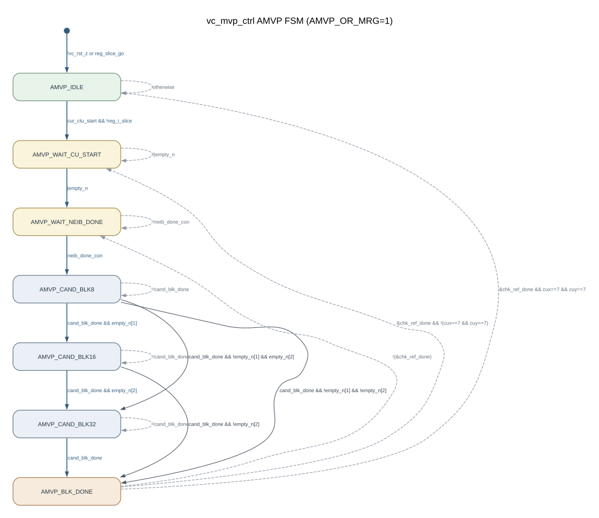

DOT：[`figures/fsm_mvp_ctrl_amvp.dot`](figures/fsm_mvp_ctrl_amvp.dot)

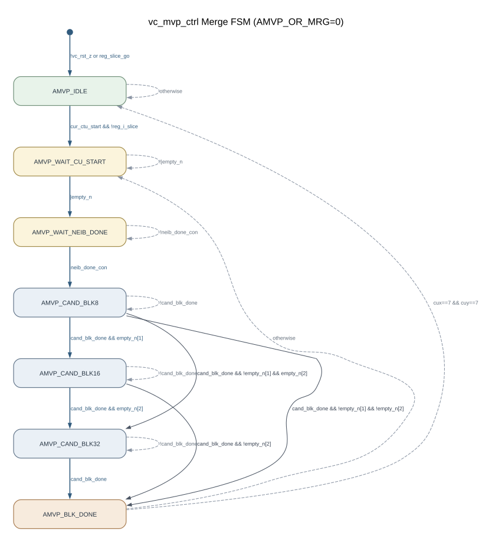

DOT：[`figures/fsm_mvp_ctrl_merge.dot`](figures/fsm_mvp_ctrl_merge.dot)

【RTL：`vc_mvp_ctrl`, L272-L403, L407-L484】

## 2.2 `vc_mvp_cand_gen.fsm_cand_cs`

复位：`!vc_rst_z` 或 `reg_slice_go` → `CAND_IDLE`。  
`cand_blk_done=fsm_cand_cs[CAND_DONE]`，`cand_blk_idle=fsm_cand_cs[CAND_IDLE]`。

### 2.2.1 AMVP variant

| 状态 | 功能/转移 |
|---|---|
| `CAND_IDLE` | 无 start 自环；有 start 后按 one-hot priority 直接完成，或进入 A/B/C scaling wait。AVC 模式的 `cand_ua_ub_con \| reg_avc_mode` 分支直接 `DONE`。 |
| `CAND_WAIT_SCALE_A` | 等 `scale_done`；随后若还需 scaled-C 则进 `WAIT_SCALE_C`，否则 `DONE`。 |
| `CAND_WAIT_SCALE_B` | 等 `scale_done`；随后若还需 scaled-C 则进 `WAIT_SCALE_C`，否则 `DONE`。 |
| `CAND_WAIT_SCALE_C` | `scale_done` → `DONE`，否则自环。 |
| `CAND_DONE` | 无条件回 `IDLE`。 |

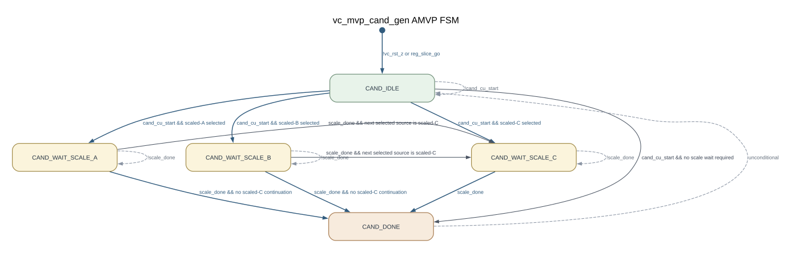

DOT：[`figures/fsm_cand_gen_amvp.dot`](figures/fsm_cand_gen_amvp.dot)

【RTL：`vc_mvp_cand_gen`, L1112-L1228】

### 2.2.2 Merge variant

| 当前状态 | 条件 | 下一状态 |
|---|---|---|
| `CAND_IDLE` | `!cand_cu_start` | `CAND_IDLE` |
| `CAND_IDLE` | selected temporal candidate 需要 scaling | `CAND_WAIT_SCALE_C` |
| `CAND_IDLE` | 其他 `cand_cu_start` 组合 | `CAND_DONE` |
| `CAND_WAIT_SCALE_C` | `!scale_done` | 自环 |
| `CAND_WAIT_SCALE_C` | `scale_done` | `CAND_DONE` |
| `CAND_DONE` | 无条件 | `CAND_IDLE` |

实际 Merge 顶层把 `mrg_cand_nr_m1` 固定为 1；因此 scaled temporal 候选需要第二槽时进入 wait。  
【RTL：`ve_mrg_top`, L226, L757；`vc_mvp_cand_gen`, L704-L840】

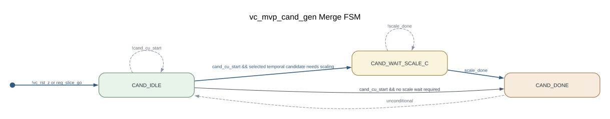

DOT：[`figures/fsm_cand_gen_merge.dot`](figures/fsm_cand_gen_merge.dot)

## 2.3 `vc_mvp_scale.fsm_mulcyc_cs`

复位：`!vc_rst_z` 或 `reg_slice_go` → `MULCYC_IDLE`。

| 当前状态 | 条件 | 下一状态 | 动作 |
|---|---|---|---|
| `MULCYC_IDLE` | `scale_start` | `MULCYC_ACT` | 捕获 MV/POC；counter 开始递增。 |
| `MULCYC_IDLE` | `!scale_start` | 自环 | — |
| `MULCYC_ACT` | `mul_cyc_cnt != MULCYC` | 自环 | counter 递增。 |
| `MULCYC_ACT` | `mul_cyc_cnt == MULCYC` | `MULCYC_IDLE` | 锁存 scaled MV，产生一周期 `scale_done`。 |

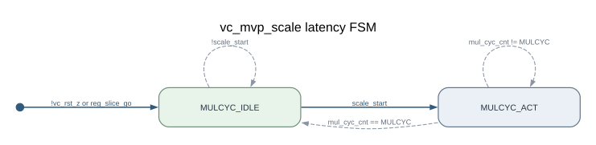

DOT：[`figures/fsm_scale.dot`](figures/fsm_scale.dot)

【RTL：`vc_mvp_scale`, L155-L233】

## 2.4 `vc_mvp_rd_mem.fsm_mem_cs`

实例：A、B、Col、Ref-list 共 4 个；状态转移相同，地址与 metadata 逻辑由参数分支决定。  
复位：`!vc_rst_z` 或 `reg_slice_go` → `MEM_IDLE`。

| 当前状态 | 条件 | 下一状态 |
|---|---|---|
| `MEM_IDLE` | `ip_cu_start` | `MEM_GET` |
| `MEM_IDLE` | 否 | 自环 |
| `MEM_GET` | `last_hsk` | `MEM_CHK_DQ` |
| `MEM_GET` | 否 | 自环 |
| `MEM_CHK_DQ` | `!n_empty_n` | `MEM_IDLE` |
| `MEM_CHK_DQ` | 否 | 自环 |

其中 `last_hsk=(mem_cnt==mem_avail_cnt-1) && mem2ip_gnt`。`MEM_CHK_DQ` 等待 metadata FIFO 的 next occupancy 为空，防止下一批 request 复用未排空的 metadata。

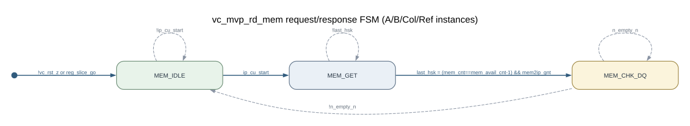

DOT：[`figures/fsm_rd_mem.dot`](figures/fsm_rd_mem.dot)

【RTL：`vc_mvp_rd_mem`, L48-L50, L91-L100, L261-L333】

## 2.5 `ve_mrg_top.fsm_mv_gain_cs`

复位：`!vc_rst_z` 或 `reg_slice_go` → `MVG_IDLE`。

| 当前状态 | 条件 | 下一状态 |
|---|---|---|
| `MVG_IDLE` | `reg_avc_mode && cand_push[2]` | `MVG_BLK16` |
| `MVG_IDLE` | `!reg_avc_mode && cand_push[1]` | `MVG_BLK8` |
| `MVG_BLK8` | `mvg_cnt==5 && cu_empty_n_reg[1]` | `MVG_BLK16` |
| `MVG_BLK8` | `mvg_cnt==5 && !cu_empty_n_reg[1]` | `MVG_IDLE` |
| `MVG_BLK16` | `mvg_cnt==5 && !reg_avc_mode && cu_empty_n_reg[2]` | `MVG_BLK32` |
| `MVG_BLK16` | `mvg_cnt==5` 且上式不成立 | `MVG_IDLE` |
| `MVG_BLK32` | `mvg_cnt==5` | `MVG_IDLE` |

各 active PU 状态在 `mvg_cnt!=5` 时自环。该 FSM 串行复用 `mul_add_accu`，不是每 PU 独立 datapath。

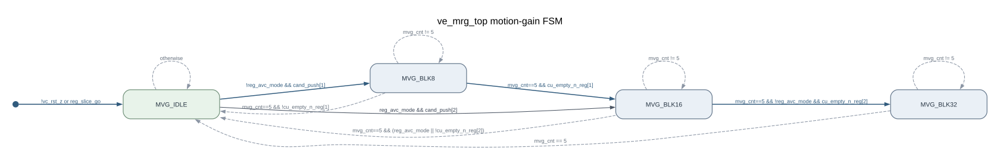

DOT：[`figures/fsm_mrg_mv_gain.dot`](figures/fsm_mrg_mv_gain.dot)

【RTL：`ve_mrg_top`, L326-L349, L833-L878, L969-L1019】

## 2.6 `ve_mrg_top.fsm_mrg_flow_cs[0:5]`

每 PU 两个实例：偶数为 candidate 0 (`idx=0`)，奇数为 candidate 1 (`idx=1`)。PU8 对应 0/1，PU16 对应 2/3，PU32 对应 4/5。  
复位：只有 `!vc_rst_z` → `MRG_IDLE`；本 state register block 没有 `reg_slice_go` 分支。

| 状态 | candidate 0 | candidate 1 |
|---|---|---|
| `MRG_IDLE` | `cand_rdy && blk_en` → `CAND_RDY` | 同左 |
| `MRG_CAND_RDY` | candidate handshake → `MC_CAND_RDY` | 无差异候选 → `IDLE`；有差异时等待 candidate 0 让路，再 handshake → `MC_CAND_RDY` |
| `MRG_MC_CAND_RDY` | cost handshake → `DONE` | 等 candidate 0 离开同状态，再在 cost handshake 时 → `DONE` |
| `MRG_DONE` | 无差异或 candidate 1 done → `IDLE`，否则等待 | 无条件 → `IDLE` |

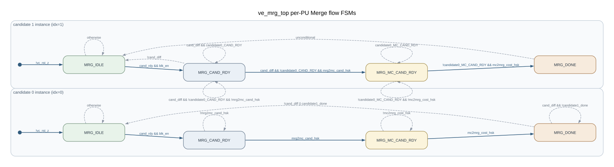

DOT：[`figures/fsm_mrg_flow.dot`](figures/fsm_mrg_flow.dot)

【RTL：`ve_mrg_top`, L258-L285, L613-L693, L1340-L1356】

## 2.7 `ve_mrg_top.fsm_mc_done_cs[0:2]`

每 PU 一个实例。状态：`MC_IDLE`、`MC_WAIT_HSK_0`、`MC_WAIT_HSK_1`、`MC_DONE`。

| 当前状态 | 条件 | 下一状态 |
|---|---|---|
| `MC_IDLE` | activation 且 candidate 1 enabled，candidate 0 已握手/在 MC-ready | `MC_WAIT_HSK_1` |
| `MC_IDLE` | activation 且 candidate 1 enabled，candidate 0 未握手 | `MC_WAIT_HSK_0` |
| `MC_IDLE` | activation 且无 candidate 1，candidate 0 已握手/在 MC-ready | `MC_DONE` |
| `MC_IDLE` | activation 且无 candidate 1，candidate 0 未握手 | `MC_WAIT_HSK_0` |
| `MC_WAIT_HSK_0` | handshake 且 `cand_diff` | `MC_WAIT_HSK_1` |
| `MC_WAIT_HSK_0` | handshake 且 `!cand_diff` | `MC_DONE` |
| `MC_WAIT_HSK_1` | handshake | `MC_DONE` |
| `MC_DONE` | 无条件 | `MC_IDLE` |

activation 在 AVC 模式为 `mrg2mc_cand_rdy[i]`，其他模式为 `cand_rdy[1] && cu_cmd_out_sel[14+i]`。

复位：

- `!vc_rst_z`：三个实例均 `MC_IDLE`。
- `reg_slice_go && !reg_avc_mode`：三个实例均 `MC_IDLE`。
- `reg_slice_go && reg_avc_mode`：lane 1 → `MC_IDLE`，lane 0/2 → `MC_DONE`。

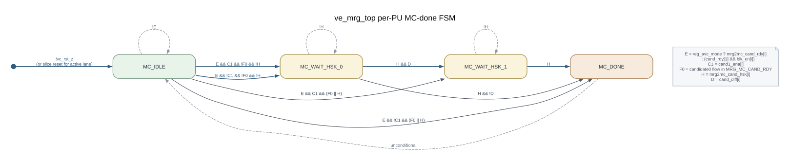

DOT：[`figures/fsm_mrg_mc_done.dot`](figures/fsm_mrg_mc_done.dot)

【RTL：`ve_mrg_top`, L904-L956, L1358-L1380】

## 2.8 Termination FSM

本节包含两个独立 one-hot state register：`ve_mrg_top.fsm_term_cs` 和
`vc_amvp_top.fsm_term_cs`。

### 2.8.1 Merge termination

复位：`!vc_rst_z` 或 `reg_slice_go` → `TERM_IDLE`。

| 当前状态 | 条件 | 下一状态 |
|---|---|---|
| `TERM_IDLE` | `!(\|cur_cu_start) && cur_cu_terminate` | `TERM_WAIT_EMPTY` |
| `TERM_WAIT_EMPTY` | `all_queue_empty` | `TERM_FLUSH` |
| `TERM_FLUSH` | `gt0==0` | `TERM_IDLE` |

其他条件自环。`all_queue_empty=~|{cmdq_empty_n,cand_empty_n,irpu_mrg_rdy}`。

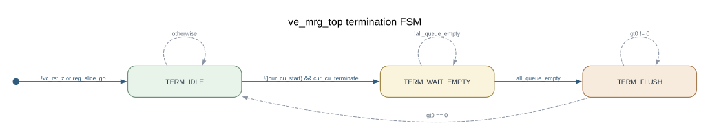

DOT：[`figures/fsm_mrg_term.dot`](figures/fsm_mrg_term.dot)

【RTL：`ve_mrg_top`, L493-L509, L880-L902, L1065-L1105】

### 2.8.2 AMVP termination

状态和 wait/flush 条件相同，但入口条件是 `|cur_cu_start && cur_cu_terminate`。  
`all_queue_empty=~|{cmdq_empty_n,cand_empty_n,irpu_amvp_rdy}`。

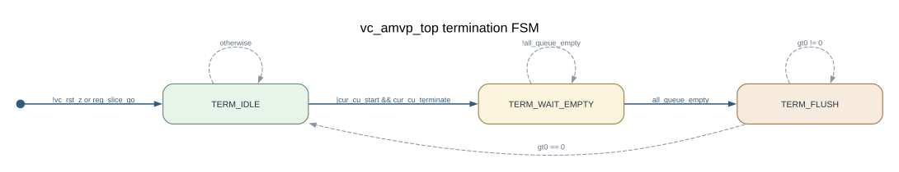

DOT：[`figures/fsm_amvp_term.dot`](figures/fsm_amvp_term.dot)

【RTL：`vc_amvp_top`, L547-L565, L888-L913, L1058-L1088】

## 2.9 `vc_mvp_get_neib.fsm_neib_cs`：非控制状态跟踪

RTL 中存在 `NEIB_IDLE` 和 `NEIB_WAIT_DONE` 两状态，并正常复位/转移：

| 当前状态 | 条件 | 下一状态 |
|---|---|---|
| `NEIB_IDLE` | `cmdq_cu_start` | `NEIB_WAIT_DONE` |
| `NEIB_WAIT_DONE` | `neib_done_con` | `NEIB_IDLE` |

但 `fsm_neib_cs` 除 next-state case 和 state register 更新外没有读引用；`neib_done_amvp/mrg` 直接等于组合 `neib_done_con`。因此它不参与活动请求、输出或完成控制，不能把它描述为有效 datapath controller。

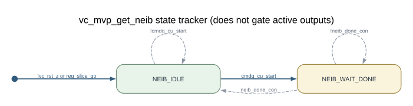

DOT：[`figures/fsm_neib_tracker.dot`](figures/fsm_neib_tracker.dot)

【RTL：`vc_mvp_get_neib`, L113-L144, L413-L426, L978-L996, L1078-L1088】

## 2.10 明确不是 FSM 的控制逻辑

- `vc_amvp_top` decoder：`dec_pending_q`、`dec_mv_valid_q`、`dec_p8_active`、`dec_expected_sub_idx` 配合 valid/ready 和 sub-index 工作，没有编码 state vector。
- `ve_mrg_top` 的 `mvg_cnt`、`term_cnt`、`toggle_cost` 是 counter/flag。
- `vc_mvp_get_neib` 的 `blk_8_start_a_con`、`blk_8_start_b_con` 是 sticky completion flag。
- `ve_mrg_top` 中 `fsm_mrg_cand` 函数没有活动调用，对应 sequential block 被注释，不是实际 FSM。
- `vc_mvp_top`、`vc_mvp_cand_prior`、`sht_mdl`、`ve_irpu_expg_bits` 没有编码 FSM。

# 3. PU8/PU16/PU32 处理架构

## 3.1 共用规则

- PU command FIFO：每尺寸独立；`vc_mvp_ctrl` 中 depth 固定为 1。
- 邻居读取 datapath：三尺寸复用同一组 A/B/Col/Ref readers 和 staging registers；读次数由尺寸/位置/availability 决定。
- candidate datapath：Merge 与 AMVP 是两个物理实例；同一路径内三尺寸串行复用一个 candidate generator。
- scaler：每个 candidate generator 至多一套，A/B/C scaling 串行使用；Merge 与 AMVP 不共用 scaler。
- SRAM：本范围内没有 SRAM module 或 SRAM macro；对外只有 memory request/response 接口。
- FIFO：使用外部 `sht_mdl`。Merge 每尺寸有独立候选/结果 FIFO；AMVP 每尺寸有独立 rendezvous/MV/result FIFO。

## 3.2 PU8

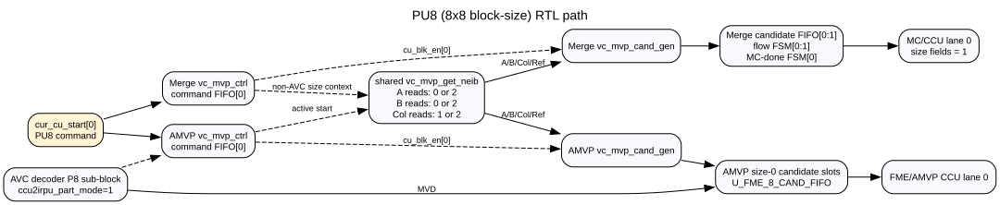

DOT：[`figures/pu8_arch.dot`](figures/pu8_arch.dot)

| 项目 | RTL 行为 |
|---|---|
| 入口条件 | encoder：`cur_cu_start[0]`；AMVP push 还要求 `!reg_i_slice && !cur_cu_is_skip && !cur_cu_terminate`；Merge push 要求 `!reg_i_slice && !cur_cu_is_zmv && !cur_cu_terminate`。decoder：`dec_accept && ccu2irpu_part_mode` 生成 `ctrl_cur_cu_start=3'b001`。 |
| 使用模块 | 两个 `vc_mvp_ctrl`、共用 `vc_mvp_get_neib`、四个 `vc_mvp_rd_mem`、两个 `vc_mvp_cand_gen`、priority/scaler、PU8 FIFO/flow/output logic。 |
| 邻居读取 | B：`cuy[0]` 为 1 时 0 次，否则 availability 有效时 2 次；A：`cux[0]` 为 1 时 0 次，否则 availability 有效时 2 次；Col：1 或 2 次。 |
| 数据流 | 34-bit A/B、42-bit Col 和 33-bit Ref-list → candidate generator → `{long,pocdiff,ref_idx,mv}` candidate。 |
| Merge 后端 | candidate FIFO index 0/1；flow FSM 0/1；MC-done FSM 0；MC/CCU lane 0；输出 size field `2'(1)`。 |
| AMVP 后端 | size index 0 的 per-ref/candidate slots + `U_FME_8_CAND_FIFO` + AMVP-to-CCU FIFO lane 0。 |
| decoder | P8 sub-index 0→1→2→3 顺序检查；每个 sub-block 等 MC 接受并更新邻居后，下一 transaction 才 ready。 |
| 完成条件 | candidate phase：`CAND_DONE`；Merge MC：lane 0 `MC_DONE`；AMVP encoder result：lane 0 queue handshake；decoder：`dec_result_fire` 置 `dec_mv_valid_q`，最终 `dec_mc_accept` 清 pending/valid 并完成更新。 |

【RTL：`vc_mvp_ctrl`, L139-L180；`vc_mvp_get_neib`, L391-L407；`ve_mrg_top`, L397-L413, L773-L831；`vc_amvp_top`, L298-L355, L434-L458, L579-L587, L790-L839, L918-L1003】

## 3.3 PU16

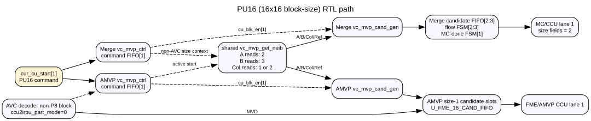

DOT：[`figures/pu16_arch.dot`](figures/pu16_arch.dot)

| 项目 | RTL 行为 |
|---|---|
| 入口条件 | encoder：`cur_cu_start[1]`，push 条件与 PU8 相同；decoder：`dec_accept && !ccu2irpu_part_mode` 生成 `ctrl_cur_cu_start=3'b010`。 |
| 使用模块 | 与 PU8 相同，但选择 command FIFO/PU state/lane 1。 |
| 邻居读取 | availability 有效时 B 3 次、A 2 次；Col 为 1 或 2 次。 |
| Merge 后端 | candidate FIFO index 2/3；flow FSM 2/3；MC-done FSM 1；MC/CCU lane 1；输出 size field `2'(2)`。 |
| AMVP 后端 | size index 1 slots + `U_FME_16_CAND_FIFO` + AMVP-to-CCU FIFO lane 1。 |
| AVC encoder 特例 | `avc_mvp_push` 只写 Merge `i==1` 的 index 2/3，因此使用 PU16 Merge 后端槽。 |
| decoder | 非 P8 transaction 要求 `ccu2irpu_sub_idx==0`；skip 只允许该模式。 |
| 完成条件 | 同 PU8，对应 lane 1。 |

【RTL：`vc_mvp_get_neib`, L393-L406；`ve_mrg_top`, L397-L409, L773-L831；`vc_amvp_top`, L308-L355, L569-L587, L769-L789】

## 3.4 PU32

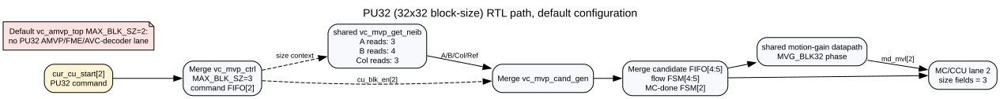

DOT：[`figures/pu32_arch.dot`](figures/pu32_arch.dot)

| 项目 | RTL 行为 |
|---|---|
| 入口条件 | `cur_cu_start[2]` 进入 Merge `vc_mvp_ctrl` 的 command FIFO[2]。 |
| 使用模块 | Merge controller/candidate generator、共用 neighbor manager/readers、PU32 candidate/result FIFO、flow FSM 4/5、MC-done FSM 2。 |
| 邻居读取 | availability 有效时 B 4 次、A 3 次；Col 固定 3 次。 |
| 数据流 | 共用 staging 数据按 PU32 映射；`blk32_neib_a/b_r[3:0]` 保存四段边界快照。 |
| 后端 | candidate FIFO index 4/5；MC/CCU lane 2；输出 size field `2'(3)`；motion-gain FSM 的 `MVG_BLK32` 阶段复用同一 accumulator。 |
| AMVP/decoder | 默认顶层 `MAX_BLK_SZ=2`，AMVP lane 2 直接置 0，也没有 PU32 FME FIFO；AVC decoder 只产生 `3'b001` 或 `3'b010`。因此默认 PU32 AMVP/decoder **未实现**。 |
| 完成条件 | candidate `CAND_DONE` → Merge flow/MC cost → lane 2 `MC_DONE`；CCU result 由 lane 2 queue handshake 完成。 |

虽然 `vc_mvp_ctrl` 含 `MAX_BLK_SZ==3 && AMVP_OR_MRG==1` generate 分支，`vc_amvp_top` 的 FME 接口和明确例化 FIFO仍只有 PU8/PU16；非默认 AMVP PU32 配置是否可用未由本工程 elaboration/test 证明，标为 **TBD**，不宣称支持。

【RTL：`vc_mvp_top`, L20, L374-L390, L469-L483；`vc_mvp_ctrl`, L202-L212；`vc_mvp_get_neib`, L393-L406, L1090-L1098；`vc_amvp_top`, L581-L587, L769-L839；`ve_mrg_top`, L428-L434, L835-L878】

## 3.5 三种 PU 的差异汇总

| 属性 | PU8 | PU16 | PU32 |
|---|---:|---:|---:|
| 尺寸位 | 0 | 1 | 2 |
| Merge 默认支持 | 是 | 是 | 是 |
| AMVP 默认支持 | 是 | 是 | 否 |
| AVC decoder 支持 | P8 sub-block | non-P8 block | 否 |
| B request 数 | 0/2 | 3 | 4 |
| A request 数 | 0/2 | 2 | 3 |
| Col request 数 | 1/2 | 1/2 | 3 |
| Merge candidate FIFO | 0/1 | 2/3 | 4/5 |
| Merge MC/CCU lane | 0 | 1 | 2 |
| AMVP MV FIFO | `U_FME_8` | `U_FME_16` | 无 |
| 边界快照段数 | 1 | 2 | 4 |
| motion-gain phase | `MVG_BLK8` | `MVG_BLK16` | `MVG_BLK32` |

# 4. TBD 与 RTL 异常边界

| 项目 | 结论 |
|---|---|
| `reg_ctu_sz` | 只传入 `ve_mrg_top` 端口，模块内无活动引用。 |
| `reg_col_l0_flag` | 传入 Merge/AMVP 端口，两个模块内均无活动引用。 |
| `reg_num_ref_l1_act_m1` | 只存在于 `vc_mvp_top` 端口，未连接到任何实例。 |
| 非-AVC decoder | `codec_mode=1 && reg_avc_mode=0` 没有 ready/valid transaction path。 |
| AMVP PU32 | controller 有参数分支，但默认 wrapper/FME 实现不完整，未宣称支持。 |
| `vc_mvp_get_neib.fsm_neib_cs` | 会转移但不控制活动信号。 |
| `vc_mvp_scale` 除数为 0 | 模块无保护；上游保证未在本范围证明。 |
| 外部 memory 时序 | request/grant/read-latency 的最大延迟、ordering 和 backpressure 合同不在本 RTL 定义。 |
| PU 系统级含义 | 仅尺寸映射由 RTL 确认，其协议层定义为 TBD。 |

# 5. 图形生成与检查记录

- 所有图均先保存为 Graphviz DOT。
- 使用 Graphviz 15.1.0 执行：`dot -Tsvg <file>.dot -o <file>.svg`。
- 每个 SVG 均通过 XML 解析。
- FSM 图的节点、边和条件已逐项对照对应 next-state `case(1)`。
- 总体图和 PU 图只绘制 RTL 中存在的实例/连接；控制流用虚线、数据流用实线。
- 未生成或引用位图。

生成图共 16 组：

1. `mvp_arch`
2. `fsm_mvp_ctrl_amvp`
3. `fsm_mvp_ctrl_merge`
4. `fsm_cand_gen_amvp`
5. `fsm_cand_gen_merge`
6. `fsm_scale`
7. `fsm_rd_mem`
8. `fsm_mrg_mv_gain`
9. `fsm_mrg_term`
10. `fsm_amvp_term`
11. `fsm_mrg_flow`
12. `fsm_mrg_mc_done`
13. `fsm_neib_tracker`
14. `pu8_arch`
15. `pu16_arch`
16. `pu32_arch`
