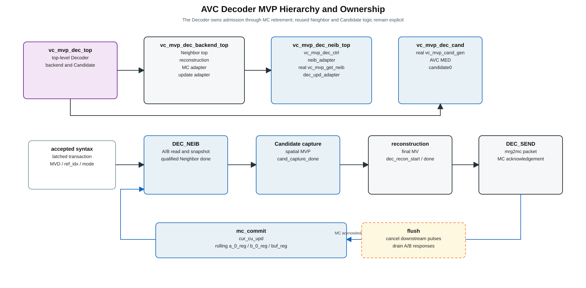
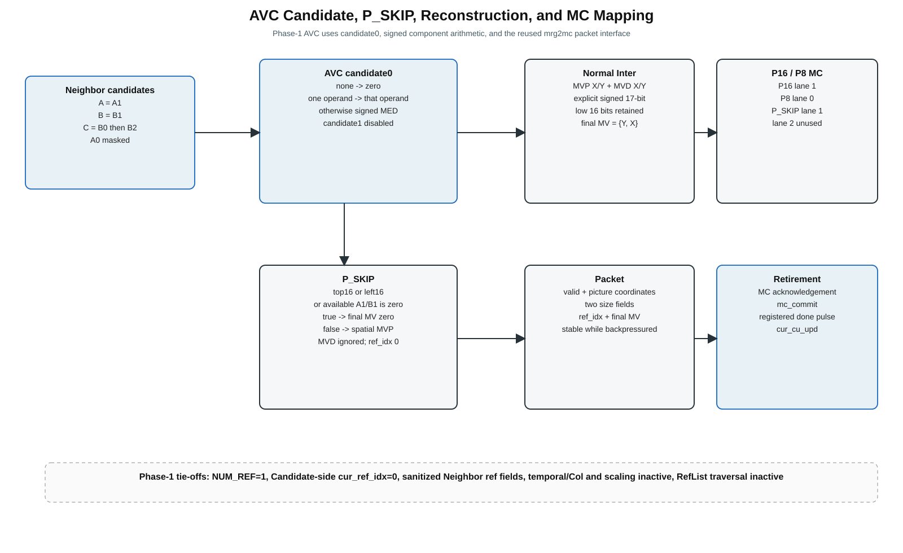
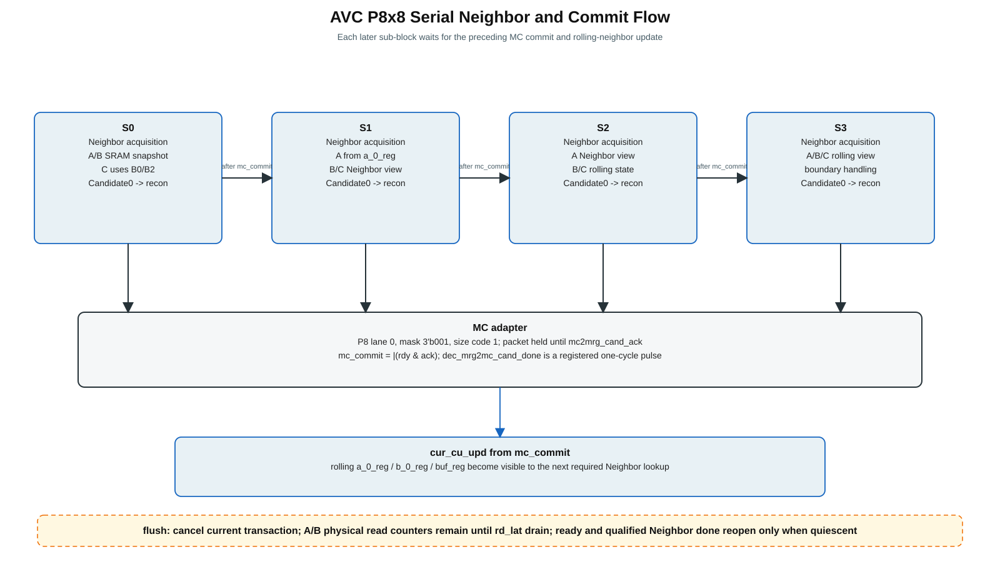

# AVC Decoder MVP Architecture Spec — v0.1

> Status: **architecture draft based on verified encoder RTL + AVC waveform findings already discussed**.  
> Scope: AVC P16×16, P8×8, P_SKIP motion-vector derivation and neighbor dependency.  
> Non-goal: HEVC AMVP/Merge decoder, B-slice/List1, encoder RDO/FME.

## 0. Source-of-truth rule

The decoder architecture is derived from the current encoder reference RTL. Old decoder attempts and the previous design-spec document are **not** used as implementation authority.

Primary source files:

- `ve_mvp_top.v`
- `ve_amvp_top.v`
- `ve_mrg_top.v`
- `vc_mvp_ctrl.v`
- `vc_mvp_get_neib.v`
- `vc_mvp_rd_mem.v`
- `vc_mvp_cand_gen.v`
- `vc_mvp_cand_prior.v`
- `vc_mvp_scale.v`
- `sht_mdl.v`

H.264 algorithm reference: Richardson, *The H.264 Advanced Video Compression Standard*, Ch. 6.4.3–6.4.4.

---

## 1. Frozen conclusions

### 1.1 Decoder equation

For AVC transmitted Inter partitions:

`final_MV = MVP + decoded_MVD`

For P_SKIP:

`final_MV = 0` when the project RTL zero-motion special condition is true; otherwise `final_MV = MVP`.

The H.264 decoder forms the same predictor MVp as the encoder and adds the decoded MVD; skipped macroblocks have no decoded vector difference and use the derived predictor directly.

### 1.2 AVC predictor

AVC uses the `MED` path in `vc_mvp_cand_gen`:

- A = `neib_a[1]`
- B = `neib_b[1]`
- C = `neib_b[0]`, with `neib_b[2]` fallback when B0 is unavailable
- X/Y are independently signed-median selected
- no AVC ref-index matching/scaling is used by the MED selector
- `cand1` is disabled in AVC mode

### 1.3 Temporal candidate

AVC waveform observation: `reg_tmp_mvp_flag == 0` throughout tested AVC encoding.

Static RTL consequence:

- `neib_c_cu_start = cmdq_cu_start & reg_tmp_mvp_flag`
- Colocated read FSM does not start
- `col_c_avail` is forced unavailable

Therefore the **AVC decoder core does not require colocated-neighbor fetch**.

### 1.4 P8×8 order

Four 8×8 sub-blocks are serial:

`S0 → S1 → S2 → S3`

Later sub-blocks consume reconstructed final MV from earlier sub-blocks through `a_0_reg / b_0_reg` and boundary `buf_reg` logic.

With `reg_tmp_mvp_flag=0`, normal/maximal spatial SRAM transactions are:

| sub-block | A SRAM | B SRAM | Col SRAM | total |
|---|---:|---:|---:|---:|
| S0 / 8_0 | 2 | 2 | 0 | 4 |
| S1 / 8_1 | 0 | 2 | 0 | 2 |
| S2 / 8_2 | 2 | 0 | 0 | 2 |
| S3 / 8_3 | 0 | 0 | 0 | 0 |

Actual A/B reads can be further reduced by availability/boundary conditions.

---

## 2. Encoder RTL evidence table

| Conclusion | RTL evidence |
|---|---|
| Top hierarchy is AMVP + Merge + shared Neighbor | `ve_mvp_top.v:265-358` (`ve_mrg_top`), `360-434` (`ve_amvp_top`), `437-519` (`vc_mvp_get_neib`) |
| `vc_mvp_ctrl` command payload is 14 bit | `vc_mvp_ctrl.v:106-119` |
| AMVP command queue excludes skip | `vc_mvp_ctrl.v:130` |
| Encoder controller traverses active L0 ref indices | `vc_mvp_ctrl.v:408-442` |
| `ve_amvp_top` turns 14-bit command into 17-bit `{blk_sz,cmd}` | `ve_amvp_top.v:197-200` |
| FME result is carried separately into CCU | `ve_amvp_top.v:225-231` |
| Encoder computes `MVD = final_MV - MVP` | `ve_amvp_top.v:258-278` |
| AVC bridge uses blk16 only | `ve_amvp_top.v:351-359`; `ve_mrg_top.v:401-404` |
| A/B request-return alignment uses request-info FIFO | `vc_mvp_rd_mem.v:81-90` |
| blk8 A/B read counts are determined by cux/cuy parity | `vc_mvp_get_neib.v:381-390` |
| Col read is gated by `reg_tmp_mvp_flag` | `vc_mvp_get_neib.v:393-399`, `419-427` |
| SRAM read data is snapshotted into `mvp_neib_*_reg` | `vc_mvp_get_neib.v:1025-1030` and corresponding A block |
| blk8 A mux uses `a_0_reg` on right-half blocks | `vc_mvp_get_neib.v:696-715` |
| blk8 B/C/B2 mux uses `b_0_reg / buf_reg` for lower-row/boundary cases | `vc_mvp_get_neib.v:717-813` |
| `cur_cu_upd` writes reconstructed motion info into rolling regs | `vc_mvp_get_neib.v:993-1015` |
| MED input fields come from command availability | `vc_mvp_cand_gen.v:203-210` |
| MED candidate output is candidate-0 | `vc_mvp_cand_gen.v:329-341` |
| signed component-wise AVC median | `vc_mvp_cand_gen.v:402-445` |
| AVC selection goes to MED and disables candidate-1 | `vc_mvp_cand_gen.v:1214-1220`, `1329` |
| ref/POC matching belongs to general AMVP priority logic | `vc_mvp_cand_prior.v:76-100` |
| temporal priority/scaling is gated by `reg_tmp_mvp_flag` | `vc_mvp_cand_prior.v:110-121` |

---

## 3. Proposed decoder module architecture

### 3.1 `DEC_CTRL` — new decoder scheduler

Purpose: replace encoder-only scheduling behavior of `vc_mvp_ctrl` without changing the proven encoder controller.

Inputs:

- decoder transaction valid
- `part_mode`: P16×16 / P8×8
- `sub_idx` for P8×8
- `cux/cuy`
- A/B availability from CCU/NMU
- `ref_idx_l0`
- signed `mvd_x/mvd_y`
- `is_skip`

Responsibilities:

1. accept one decoded partition transaction only when local transaction storage is available;
2. form the same spatial command context consumed by Neighbor/Candidate logic;
3. P16: one transaction;
4. P8: enforce `S0→S1→S2→S3` ordering;
5. start neighbor fetch;
6. wait for `neib_done` before starting MED candidate generation;
7. **do not** traverse reference indices;
8. hold syntax payload until final-MV result is committed downstream.

Recommended internal command representation:

`{blk_sz[2:0], term, skip, zmv, a_avail[1:0], b_avail[2:0], cuy[2:0], cux[2:0]}`

The lower 14 bits intentionally match encoder `cu_cmd_out`; decoder-only `MVD/ref_idx/sub_idx` remain a separate payload and should not be packed into that legacy command.

### 3.2 `vc_mvp_get_neib` — reuse spatial Neighbor Manager

Reuse:

- A/B `vc_mvp_rd_mem`
- request/gnt/rd_lat alignment
- `mvp_neib_a_reg / mvp_neib_b_reg` snapshot registers
- `a_0_reg / b_0_reg` rolling registers
- `buf_reg` boundary/corner special handling
- `get_rd_neib_a/b()` and `get_neib_a/b()` mapping rules

AVC decode policy:

- `reg_tmp_mvp_flag = 0`
- colocated path stays idle
- RefList data is not consumed by the MED datapath; first implementation may leave the existing RefList engine structurally present to minimize RTL disturbance, then optionally gate it in a later cleanup task

### 3.3 `vc_mvp_cand_gen` — reuse only AVC MED behavior

Recommended first implementation: reuse the existing module with `AMVP_OR_MRG=1`, `reg_avc_mode=1` and consume only candidate-0 MVP.

This intentionally leaves `vc_mvp_cand_prior` and `vc_mvp_scale` instantiated but functionally irrelevant to the AVC MED result. This is safer for the first decoder implementation than extracting/re-writing the median logic immediately.

Decoder-consumed output:

`mvp_x = cand_mv[0][15:0]`

`mvp_y = cand_mv[0][31:16]`

Do not use candidate embedded `ref_idx` as the decoded reference index. The current partition's `ref_idx_l0` comes from the decoded syntax payload and is carried separately.

### 3.4 `DEC_RECON` — new final-MV reconstruction

Inter P16/P8:

`final_mvx = signed(mvp_x) + signed(mvd_x)`

`final_mvy = signed(mvp_y) + signed(mvd_y)`

P_SKIP:

- obtain the same blk16 MED predictor;
- apply project zero-motion rule equivalent to encoder `ve_amvp_top.v:357-359`;
- no FME, no decoded MVD;
- output `0` or median MVP directly as final MV.

### 3.5 Decoder result boundary

The MVP decoder core outputs a reconstructed motion transaction:

- final MVX/MVY
- parsed `ref_idx_l0`
- block size / position / sub-index
- skip/inter mode

The exact binding to CCU's decoder-side ports is intentionally a wrapper-level contract. The architectural requirement is:

- result must remain stable until downstream accepts it;
- CCU uses the accepted final MV to issue MC;
- CCU then emits `cur_cu_upd` commit with the same reconstructed motion information.

This keeps the existing ownership model: **CCU owns MC scheduling and `cur_cu_upd`; MVP owns predictor/reconstruction.**

---

## 4. P8×8 neighbor/data-flow detail

### 4.1 Source-class mapping

| sub-block | A | B | C (spatial) | B2 fallback |
|---|---|---|---|---|
| S0 | SRAM snapshot | SRAM snapshot | SRAM snapshot | SRAM snapshot / boundary rule |
| S1 | `a_0_reg` from S0 | SRAM snapshot | SRAM snapshot | SRAM snapshot / boundary rule |
| S2 | SRAM snapshot | `b_0_reg` from S0 | `b_0_reg` from S1 | `buf_reg` / rolling special case |
| S3 | `a_0_reg` from S2 | `b_0_reg` from S1 | rolling/boundary case | rolling/boundary case |

Exact index selection remains the existing `get_neib_a()` / `get_neib_b()` RTL; decoder must **reuse the function behavior rather than re-derive it from a simplified geometry table**.

### 4.2 Commit dependency

`cur_cu_upd` is not a ready/valid transaction. It is a commit pulse carrying stable reconstructed motion information.

For P8, later sub-block candidate generation must not begin before the required prior sub-block commit has updated `a_0_reg/b_0_reg`.

---

## 5. Motion-neighbor persistence loop

The reconstructed final MV participates in three storage horizons:

1. **intra-current-CU rolling state**: `a_0_reg/b_0_reg` in `vc_mvp_get_neib`;
2. **same-CTU NMU buffers**: immediate `cur_cu_upd` update in upstream NMU;
3. **cross-row MVB SRAM persistence**: upstream row buffer accumulates CU updates and DMA-writes MVB at row/CTU boundary.

Decoder MVP must not directly implement MVB write arbitration. It only needs to ensure the final reconstructed motion is returned so CCU can issue the established `cur_cu_upd` commit.

---

## 6. Encoder-only logic explicitly excluded from AVC decoder core

- FME/IME motion search
- FME SATD/min-position logic
- encoder `MVD = final_MV - MVP`
- `vc_mvp_ctrl` reference-index traversal
- HEVC candidate-0/candidate-1 cost selection
- AVC `avc_mvp_push → ve_mrg_top → MC cost` encoder mode-decision path
- Merge RDO/cost comparison
- colocated temporal candidate
- temporal/spatial MV scaling for AVC MED

`ve_mrg_top` remains encoder-side logic. P_SKIP decoder reconstruction is performed directly from the MED predictor and zero-motion rule; it does not need the encoder Merge-cost subsystem.

---

## 7. Reuse / modify / new matrix

| RTL block | Decoder action | Reason |
|---|---|---|
| `ve_mvp_top` | integration change only | route `codec_mode`, selected control, neighbor/result boundary |
| `ve_amvp_top` | keep encoder path untouched | contains FME FIFO, MVD-cost and encoder queues |
| `vc_mvp_ctrl` | **do not reuse as decoder scheduler** | skip filter + ref traversal are encoder behavior |
| new `DEC_CTRL` | **new** | parsed syntax drives one exact partition transaction |
| `vc_mvp_get_neib` | **reuse** | spatial fetch/snapshot/rolling behavior is required |
| `vc_mvp_rd_mem` A/B | **reuse** | proven SRAM request-return alignment |
| Col `vc_mvp_rd_mem` | dormant | AVC tested with `reg_tmp_mvp_flag=0` |
| RefList `vc_mvp_rd_mem` | not consumed by MED | leave structurally present first; optional later gate |
| `vc_mvp_cand_gen` | **reuse MED branch** | bit-exact predictor source |
| `vc_mvp_cand_prior` | present but bypassed for MED | ref matching/scaling not used by AVC MED selector |
| `vc_mvp_scale` | present but bypassed | AVC MED does not use it |
| new `DEC_RECON` | **new** | `MVP+MVD` / P_SKIP final MV |
| `ve_mrg_top` | bypass decoder | encoder skip/inter RDO cost path only |
| `sht_mdl` | optional reuse | input/result elasticity if explicit FIFO is selected |

---

## 8. Control sequence

### 8.1 P16×16 Inter

1. CCU/parser presents decoded P16 transaction.
2. `DEC_CTRL` accepts and latches MVD/ref_idx/context.
3. Start A/B Neighbor fetch.
4. Wait `neib_done`.
5. Start AVC MED candidate generation.
6. Obtain MVP.
7. `DEC_RECON`: `final_MV = MVP + MVD`.
8. Return final-MV transaction to CCU.
9. CCU issues MC and `cur_cu_upd` commit.

### 8.2 P8×8 Inter

Repeat the P16 flow once per `S0/S1/S2/S3`, but enforce serial ordering and wait for the prior sub-block's `cur_cu_upd` dependency before starting a sub-block that consumes its rolling neighbor.

### 8.3 P_SKIP

1. accept skip transaction;
2. use blk16 spatial Neighbor View;
3. generate MED;
4. apply zero-motion special rule;
5. return final skip MV directly; no MVD reconstruction and no FME.

---

## 9. Luna implementation task boundaries

The following split is ready to be converted into strict Codex task packets after interface names are frozen:

| Task | Scope | Main files |
|---|---|---|
| T00 | decoder top-level transaction contract / `codec_mode` routing | MVP top wrapper only |
| T01 | `DEC_CTRL`: P16 command + input rendezvous | new decoder control file |
| T02 | shared Neighbor integration for decoder; Col disabled | top + `vc_mvp_get_neib` wiring only |
| T03 | MED reuse path and decoder MVP extraction | decoder top + `vc_mvp_cand_gen` interface |
| T04 | signed `MVP+MVD` reconstruction | new reconstruction block |
| T05 | P_SKIP zero-motion + MED reconstruction | decoder reconstruction/control |
| T06 | P8 `S0→S3` scheduler and dependency checks | decoder control |
| T07 | `cur_cu_upd` rolling-neighbor closure | decoder/top integration + existing get_neib ports |
| T08 | result holding/backpressure and CCU binding | decoder top / CCU interface |
| T09 | assertions + directed P16/P8/P_SKIP tests | verification only |

Hard rule for Luna: each task may modify only the files explicitly named in that task packet; no architecture redesign and no opportunistic cleanup.

---

## 10. Items not yet frozen

These are intentionally left open rather than guessed:

1. exact decoder result bus binding inside CCU (`existing AMVP-like interface` vs dedicated decoder result channel);
2. exact signed overflow/wrap rule for 16-bit final MV at the implementation boundary;
3. whether first implementation should gate the unused RefList read engine in decoder mode or leave it harmlessly present;
4. exact upstream signal name that converts decoded parser syntax to the proposed decoder transaction.

These four items should be resolved before Luna receives T00/T04/T08, but they do not change the core Neighbor → MED → reconstruction architecture above.
