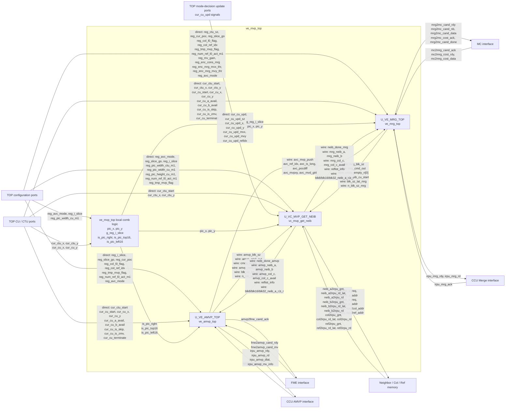
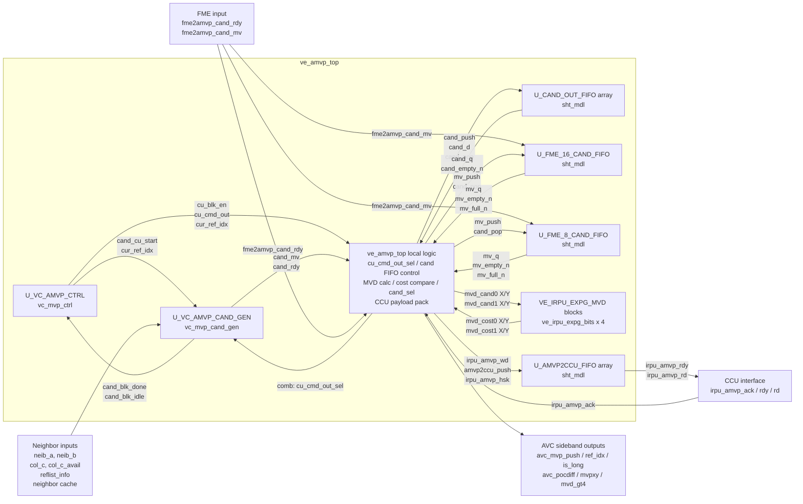
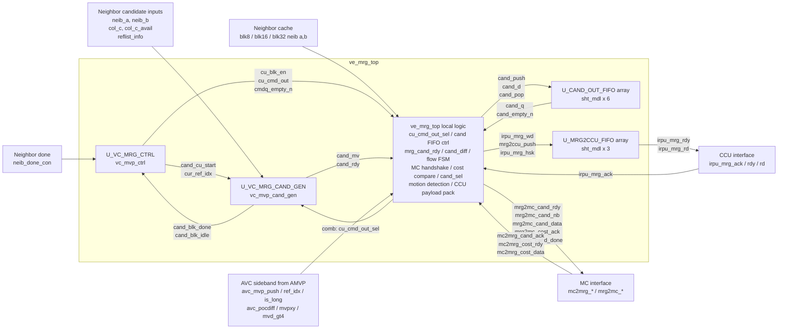
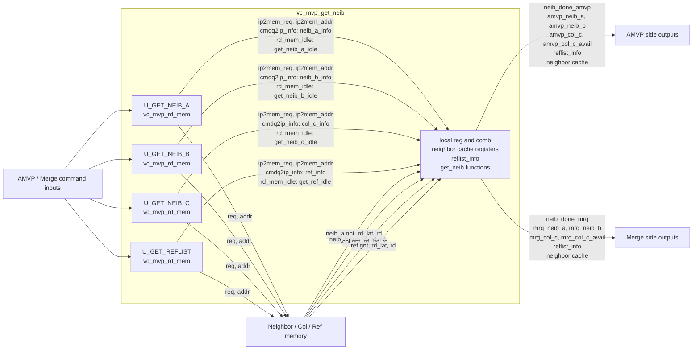

# MVP Encoder RTL Module Signal Interconnect

> 范围：`src_encoder_ref`，从 `ve_mvp_top` 开始，向下追踪所有当前 RTL 中实际例化的 MVP 子模块。
>
> 目标：厘清父子模块以及同级子模块经父层 `wire/reg` 中转后的输入/输出关系。本文只记录当前 RTL 可直接核对的连接，不用标准行为补全源码未体现的路径。

## 0. 分析基线与记号

### 0.1 当前 `main` 源码快照

| 文件 | blob SHA |
|---|---|
| `ve_mvp_top.v` | `1842d5f5e7b30c8c14f7aaa8ecd827bd6229d5ee` |
| `ve_amvp_top.v` | `ee1b4d20fe6278e6fde64cd6d5b39f4b7ec43aba` |
| `ve_mrg_top.v` | `3b8b96c954b93ed0d862910c2e3cade0e7a377f0` |
| `vc_mvp_get_neib.v` | `ccbaf519f28c2ac72c4fd8183ae4ac3868179468` |
| `vc_mvp_ctrl.v` | `f27c722ac51dfb6688ad80ac6b03f591aacf6b20` |
| `vc_mvp_cand_gen.v` | `0a097356135f8a66ec52cb4f7df06165fd2b6e22` |
| `vc_mvp_cand_prior.v` | `c9733b1c5e9fef4a651e1867ed0c9231d320bf4e` |
| `vc_mvp_scale.v` | `3c15b593b651e0d0d715fff2fe8a960f550e014a` |
| `vc_mvp_rd_mem.v` | `0a6a12304a2fbb1d4205c875b084d743ef581e29` |
| `sht_mdl.v` | `4bac4686df22ee5aadb22f0139e8a4516c045f12` |
| `ve_irpu_expg_bits.v` | `3bf6f8999b29a232e5deb3b4fcfa68ade9a64322` |

### 0.2 方向记号

- `A.out -> [wire] -> B.in`：A 是信号生产者，B 是消费者，中间由父模块 `wire` 中转。
- `[comb/reg]`：信号在父模块先经过组合赋值或局部寄存器，再送往子模块。
- `[TOP PORT]`：直接来自/去往 `ve_mvp_top` 顶层端口。
- `sht_mdl` 的基本方向固定为：`push/pop/d/clk/rstz -> FIFO`，`FIFO -> full_n/n_full_n/empty_n/n_empty_n/q`。

---

## 1. 模块层次

```text
ve_mvp_top
├─ U_VE_MRG_TOP        : ve_mrg_top
│  ├─ U_VC_MRG_CTRL    : vc_mvp_ctrl      (AMVP_OR_MRG=0)
│  │  └─ ccu_cmdq[]    : sht_mdl
│  ├─ U_VC_MRG_CAND_GEN: vc_mvp_cand_gen  (AMVP_OR_MRG=0)
│  │  ├─ U_VC_MVP_CAND_PRIOR : vc_mvp_cand_prior
│  │  └─ U_VC_SCALE_CAL      : vc_mvp_scale   (MVP_SCALE_EN=1 时生成)
│  ├─ U_CAND_OUT_FIFO[]: sht_mdl
│  └─ U_MRG2CCU_FIFO[] : sht_mdl
├─ U_VE_AMVP_TOP       : ve_amvp_top
│  ├─ U_VC_AMVP_CTRL   : vc_mvp_ctrl      (AMVP_OR_MRG=1)
│  │  └─ ccu_cmdq[]    : sht_mdl
│  ├─ U_VC_AMVP_CAND_GEN: vc_mvp_cand_gen (AMVP_OR_MRG=1)
│  │  ├─ U_VC_MVP_CAND_PRIOR : vc_mvp_cand_prior
│  │  └─ U_VC_SCALE_CAL      : vc_mvp_scale   (MVP_SCALE_EN=1 时生成)
│  ├─ U_CAND_OUT_FIFO[]: sht_mdl
│  ├─ U_FME_16_CAND_FIFO / U_FME_8_CAND_FIFO : sht_mdl
│  ├─ U_AMVP2CCU_FIFO[]: sht_mdl
│  └─ VE_IRPU_EXPG_MVD_CAND{0,1}_{X,Y}: ve_irpu_expg_bits
└─ U_VC_MVP_GET_NEIB   : vc_mvp_get_neib
   ├─ U_GET_NEIB_A      : vc_mvp_rd_mem (NEIB_DIR_TYPE=1)
   │  └─ mem_cmd_fifo   : sht_mdl
   ├─ U_GET_NEIB_B      : vc_mvp_rd_mem (NEIB_DIR_TYPE=0)
   │  └─ mem_cmd_fifo   : sht_mdl
   ├─ U_GET_NEIB_C      : vc_mvp_rd_mem (NEIB_DIR_TYPE=2)
   │  └─ mem_cmd_fifo   : sht_mdl
   └─ U_GET_REFLIST     : vc_mvp_rd_mem (NEIB_DIR_TYPE=3)
      └─ mem_cmd_fifo   : sht_mdl
```

源码锚点：`ve_mvp_top.v::U_VE_MRG_TOP/U_VE_AMVP_TOP/U_VC_MVP_GET_NEIB`；各下级实例见对应文件的 `// instantiation` 区域。

---

## 1A. 模块互连图

### 1A.1 `ve_mvp_top` 一级模块互连图

> 依据：`ve_mvp_top.v` 的顶层端口、`pic_x_y_assign_blk`/`g_reg_i_slice`/`is_pic_*` 组合逻辑，以及 `U_VE_MRG_TOP`、`U_VE_AMVP_TOP`、`U_VC_MVP_GET_NEIB` 三个实例端口。图中把“顶层端口直连子模块”和“先经过 `ve_mvp_top` 本层组合逻辑再送子模块”明确分开。



该图只表达 `ve_mvp_top` 层真实可见的端口/内部 net 连接，不把下级模块内部数据流继续展开。需要特别注意：

- `pic_x/pic_y` 不是外部输入，而是 `ve_mvp_top` 根据 `cur_ctu_x/y + cur_cu_x/y` 组合产生，随后送给 `ve_mrg_top` 和 `vc_mvp_get_neib`。
- `g_reg_i_slice = reg_avc_mode | reg_i_slice`，因此 Merge 的 `reg_i_slice` 输入经过顶层变换；AMVP 与 Neighbor 接收的仍是原始 `reg_i_slice`。
- `is_pic_right/is_pic_top16/is_pic_left16` 都在顶层组合产生，只送 `ve_amvp_top`。
- `avc_mvp_push/ref_idx/is_long/pocdiff/mvpxy/mvd_gt4` 的 Producer 是 `ve_amvp_top`，经 `ve_mvp_top` 同名 `wire` 后送入 `ve_mrg_top`，不经过 Neighbor。
- `reg_num_ref_l1_act_m1` 虽然是 `ve_mvp_top` 输入端口，但当前三个子模块实例均未连接它；因此不画入有效互连图。
- 顶层 debug 拼接/选择属于观测路径，本图不展开，不应与功能数据路径混画。

### 1A.2 `ve_amvp_top` 内部互连图

> 依据：`ve_amvp_top` 中 `U_VC_AMVP_CTRL`、`U_VC_AMVP_CAND_GEN`、`U_CAND_OUT_FIFO`、`U_FME_*_CAND_FIFO`、`U_AMVP2CCU_FIFO`、`VE_IRPU_EXPG_*` 的实例端口及本层 `assign/always`。图中特别区分“子模块之间直接连线”和“先回到 `ve_amvp_top` 本层组合逻辑再继续流转”。



关键点：`VE_IRPU_EXPG_MVD_*` 的 `mvd_cost*` **不会回送 `vc_mvp_cand_gen`**。它们只回到 `ve_amvp_top` 本层，先形成 `mvdcost_cand0_sum/mvdcost_cand1_sum`，再比较得到 `cand_sel`；`cand_sel` 随后选择写入 `irpu_amvp_wd` 的 MVD、long-term、POC-diff 等字段。AVC 模式下 `cand_sel = 0`，即固定选择 candidate 0。

### 1A.3 `ve_mrg_top` 内部互连图

> 依据：`ve_mrg_top` 中 `U_VC_MRG_CTRL`、`U_VC_MRG_CAND_GEN`、`U_CAND_OUT_FIFO`、`U_MRG2CCU_FIFO` 的实例端口，以及本层 `assign/always/FSM`。图中不把本层组合/寄存器逻辑误画成子模块之间的直接连线。



关键点：`vc_mvp_cand_gen` **不直接连接 Candidate FIFO，也不直接连接 MC**。它只输出 `cand_mv/cand_rdy` 到 `ve_mrg_top` 本层；本层再生成 `cand_push/cand_d` 写入 6 个 candidate FIFO。FIFO 的 `cand_q` 回到本层，用于 `mrg2mc_cand_data`、MC cost 对应的 `cand_sel`、MVBS/motion-level 计算以及最终 `irpu_mrg_wd` 打包。`cand_pop` 也是本层根据 MC cost handshake 与 Merge flow FSM 产生，再同时回到两个 candidate FIFO。

### 1A.4 `vc_mvp_get_neib` 内部互连图

> 依据：`vc_mvp_get_neib` 内 4 个 `vc_mvp_rd_mem` 实例与外部 memory 回读、以及本层对 `*_rd` 数据的缓存/选择逻辑。



> 重要限制：图中 `mrg_cu_start -> vc_mvp_get_neib` 仅表示**端口连接存在**；当前 `vc_mvp_get_neib` 内部 `cmdq_cu_start` 实际写死为 `amvp_cu_start`，见下文 2.7。图不能据此解读为 Merge 能独立启动 Neighbor。

---

## 2. `ve_mvp_top`：三个一级子模块之间的信号关系

### 2.1 AMVP -> Neighbor

| Producer | 父层中转 | Consumer | 方向/作用 |
|---|---|---|---|
| `U_VE_AMVP_TOP.cu_blk_en` | `[wire] amvp_blk_sz[2:0]` | `U_VC_MVP_GET_NEIB.amvp_blk_sz` | AMVP -> Neighbor，当前 AMVP block size one-hot |
| `U_VE_AMVP_TOP.cu_cmd_out` | `[wire] amvp_cmd_out[2:0][13:0]` | `U_VC_MVP_GET_NEIB.amvp_cmd_out` | AMVP -> Neighbor，CU command |
| `U_VE_AMVP_TOP.cmdq_empty_n` | `[wire] cmdq_empty_n[1][2:0]` | `U_VC_MVP_GET_NEIB.cmdq_empty_n[1]` | AMVP -> Neighbor，AMVP command queue 状态 |
| `U_VE_AMVP_TOP.neib_cu_start` | `[wire] amvp_neib_cu_start` | `U_VC_MVP_GET_NEIB.amvp_cu_start` | AMVP -> Neighbor，邻居读取启动 |
| `U_VE_AMVP_TOP.blk_sz_lat` | `[wire] blk_sz_lat_amvp` | `U_VC_MVP_GET_NEIB.blk_sz_lat_amvp` | AMVP -> Neighbor，block-size 切换脉冲 |
| `U_VE_AMVP_TOP.n_blk_sz` | `[wire] n_blk_sz_amvp[2:0]` | `U_VC_MVP_GET_NEIB.n_blk_sz_amvp` | AMVP -> Neighbor，下一 block-size 状态 |

### 2.2 Neighbor -> AMVP

| Producer | 父层中转 | Consumer | 方向/作用 |
|---|---|---|---|
| `U_VC_MVP_GET_NEIB.neib_done_amvp` | `[wire] neib_done_amvp` | `U_VE_AMVP_TOP.neib_done_con` | Neighbor -> AMVP，邻居准备完成 |
| `amvp_neib_b` | `[wire] amvp_neib_b[2:0][33:0]` | `U_VE_AMVP_TOP.neib_b` | Neighbor -> AMVP，B0/B1/B2 运动信息 |
| `amvp_neib_a` | `[wire] amvp_neib_a[1:0][33:0]` | `U_VE_AMVP_TOP.neib_a` | Neighbor -> AMVP，A0/A1 运动信息 |
| `amvp_col_c` | `[wire] amvp_col_c[1:0][41:0]` | `U_VE_AMVP_TOP.col_c` | Neighbor -> AMVP，colocated C0/C1 |
| `amvp_col_c_avail` | `[wire] amvp_col_c_avail[1:0]` | `U_VE_AMVP_TOP.col_c_avail` | Neighbor -> AMVP，C0/C1 availability |
| `reflist_info` | `[wire] reflist_info[NUM_REF-1:0][32:0]` | `U_VE_AMVP_TOP.reflist_info` | Neighbor -> AMVP，RefList POC/long-term |
| `blk32_neib_b_r` / `blk16_neib_b_r` / `blk8_neib_b_r` | `[wire] 同名` | `U_VE_AMVP_TOP.blk*_neib_b_r` | Neighbor -> AMVP，MVBS 辅助邻居缓存 |
| `blk32_neib_a_r` / `blk16_neib_a_r` / `blk8_neib_a_r` | `[wire] 同名` | `U_VE_AMVP_TOP.blk*_neib_a_r` | Neighbor -> AMVP，MVBS 辅助邻居缓存 |

### 2.3 Merge -> Neighbor

| Producer | 父层中转 | Consumer | 方向/作用 |
|---|---|---|---|
| `U_VE_MRG_TOP.cu_blk_en` | `[wire] mrg_blk_sz[2:0]` | `U_VC_MVP_GET_NEIB.mrg_blk_sz` | Merge -> Neighbor，Merge block size |
| `U_VE_MRG_TOP.cu_cmd_out` | `[wire] mrg_cmd_out[2:0][13:0]` | `U_VC_MVP_GET_NEIB.mrg_cmd_out` | Merge -> Neighbor，Merge CU command |
| `U_VE_MRG_TOP.cmdq_empty_n` | `[wire] cmdq_empty_n[0][2:0]` | `U_VC_MVP_GET_NEIB.cmdq_empty_n[0]` | Merge -> Neighbor，Merge queue 状态 |
| `U_VE_MRG_TOP.neib_cu_start` | `[wire] mrg_neib_cu_start` | `U_VC_MVP_GET_NEIB.mrg_cu_start` | Merge -> Neighbor，端口有连接；**当前有效启动逻辑见 2.7** |
| `U_VE_MRG_TOP.blk_sz_lat` | `[wire] blk_sz_lat_mrg` | `U_VC_MVP_GET_NEIB.blk_sz_lat_mrg` | Merge -> Neighbor，block-size 切换脉冲 |
| `U_VE_MRG_TOP.n_blk_sz` | `[wire] n_blk_sz_mrg[2:0]` | `U_VC_MVP_GET_NEIB.n_blk_sz_mrg` | Merge -> Neighbor，下一 block-size 状态 |

### 2.4 Neighbor -> Merge

| Producer | 父层中转 | Consumer | 方向/作用 |
|---|---|---|---|
| `neib_done_mrg` | `[wire] neib_done_mrg` | `U_VE_MRG_TOP.neib_done_con` | Neighbor -> Merge，邻居准备完成 |
| `mrg_neib_b` | `[wire] mrg_neib_b[2:0][33:0]` | `U_VE_MRG_TOP.neib_b` | Neighbor -> Merge，B-side |
| `mrg_neib_a` | `[wire] mrg_neib_a[1:0][33:0]` | `U_VE_MRG_TOP.neib_a` | Neighbor -> Merge，A-side |
| `mrg_col_c` | `[wire] mrg_col_c[1:0][41:0]` | `U_VE_MRG_TOP.col_c` | Neighbor -> Merge，colocated |
| `mrg_col_c_avail` | `[wire] mrg_col_c_avail[1:0]` | `U_VE_MRG_TOP.col_c_avail` | Neighbor -> Merge，colocated availability |
| `reflist_info` | `[wire] 同 AMVP 共用` | `U_VE_MRG_TOP.reflist_info` | Neighbor -> Merge，RefList |
| `blk{32,16,8}_neib_{a,b}_r` | `[wire] 与 AMVP 共用` | `U_VE_MRG_TOP.blk*_neib_*_r` | Neighbor -> Merge，MVBS 辅助数据 |

### 2.5 AMVP -> Merge 的 AVC sideband

这些信号并不经过 Neighbor，而是由 `ve_mvp_top` 的同名内部 `wire` 直接把 AMVP 输出接到 Merge 输入。

| Producer | `[wire]` | Consumer |
|---|---|---|
| `U_VE_AMVP_TOP.avc_mvp_push` | `avc_mvp_push` | `U_VE_MRG_TOP.avc_mvp_push` |
| `U_VE_AMVP_TOP.avc_ref_idx` | `avc_ref_idx[1:0]` | `U_VE_MRG_TOP.avc_ref_idx` |
| `U_VE_AMVP_TOP.avc_is_long` | `avc_is_long` | `U_VE_MRG_TOP.avc_is_long` |
| `U_VE_AMVP_TOP.avc_pocdiff` | `avc_pocdiff[7:0]` | `U_VE_MRG_TOP.avc_pocdiff` |
| `U_VE_AMVP_TOP.avc_mvpxy` | `avc_mvpxy[1:0][15:0]` | `U_VE_MRG_TOP.avc_mvpxy` |
| `U_VE_AMVP_TOP.avc_mvd_gt4` | `avc_mvd_gt4[1:0][3:0]` | `U_VE_MRG_TOP.avc_mvd_gt4` |

### 2.6 顶层组合中转后再送子模块的信号

| 顶层来源 | 中间信号 | 去向 | 备注 |
|---|---|---|---|
| `reg_avc_mode`, `reg_i_slice` | `[wire/assign] g_reg_i_slice = reg_avc_mode \| reg_i_slice` | `U_VE_MRG_TOP.reg_i_slice` | Merge 接收的不是原始 `reg_i_slice` |
| `cur_ctu_x/cur_cu_x` | `[reg comb] pic_x` | `U_VE_MRG_TOP.pic_x`, `U_VC_MVP_GET_NEIB.pic_x` | 当前块像素 X 坐标 |
| `cur_ctu_y/cur_cu_y` | `[reg comb] pic_y` | `U_VE_MRG_TOP.pic_y`, `U_VC_MVP_GET_NEIB.pic_y` | 当前块像素 Y 坐标 |
| 图宽/当前坐标 | `[wire/assign] is_pic_right[1:0]` | `U_VE_AMVP_TOP.is_pic_right` | AVC AMVP B2 availability 相关 |
| 当前坐标 | `[wire/assign] is_pic_top16` | `U_VE_AMVP_TOP.is_pic_top16` | AVC/MVBS 辅助 |
| 当前坐标 | `[wire/assign] is_pic_left16` | `U_VE_AMVP_TOP.is_pic_left16` | AVC/MVBS 辅助 |

### 2.7 **必须注意：端口已连接不等于当前有效控制路径**

`vc_mvp_get_neib.v` 当前有以下直接赋值：

```verilog
assign cmdq_cu_start  = amvp_cu_start;
assign cu_cmd_out     = amvp_cmd_out[0];
assign g_cmdq_empty_n = cmdq_empty_n[reg_avc_mode];
```

因此：

1. `mrg_cu_start -> U_VC_MVP_GET_NEIB.mrg_cu_start` **物理上有端口连接**，但当前 `cmdq_cu_start` 的有效来源被写死为 `amvp_cu_start`。
2. 当前 Neighbor 主命令 `cu_cmd_out` 被写死取 `amvp_cmd_out[0]`。
3. `g_cmdq_empty_n` 才根据 `reg_avc_mode` 在 Merge/AMVP 两组 queue 状态之间选择。

结论只描述当前 RTL：`mrg_cu_start` 不能按“已连接”直接等价为“能够启动 Neighbor”。后续若改 Merge/Decoder 路径，需要回看这里。

---

## 3. `ve_amvp_top` 内部例化关系

源码锚点：`ve_amvp_top.v::U_VC_AMVP_CTRL/U_VC_AMVP_CAND_GEN/U_CAND_OUT_FIFO/U_FME_*_CAND_FIFO/U_AMVP2CCU_FIFO/VE_IRPU_EXPG_*`。

### 3.1 `U_VC_AMVP_CTRL -> U_VC_AMVP_CAND_GEN`

| Producer | 本层中转 | Consumer | 说明 |
|---|---|---|---|
| `U_VC_AMVP_CTRL.cand_cu_start` | `[wire] cand_cu_start` | `U_VC_AMVP_CAND_GEN.cand_cu_start` | 候选生成启动 |
| `U_VC_AMVP_CTRL.cur_ref_idx` | `[wire] cur_ref_idx[3:0]` | `U_VC_AMVP_CAND_GEN.cur_ref_idx = cur_ref_idx[1:0]` | 当前 reference index，送 cand_gen 时截取低 2 bit |
| `U_VC_AMVP_CTRL.cu_blk_en` | `[wire] cu_blk_en[2:0]` | `[comb] cu_cmd_out_sel[16:14]` | 选择当前 block size |
| `U_VC_AMVP_CTRL.cu_cmd_out` | `[wire] cu_cmd_out[2:0][13:0]` | `[comb] cu_cmd_out_sel[13:0] -> cand_gen.cu_cmd_out` | 先按 `cu_blk_en` 选 command，再拼 block-size one-hot |
| `U_VC_AMVP_CTRL.blk_sz_lat` | `[wire] blk_sz_lat` | `ve_amvp_top.blk_sz_lat` | 向上一层透传，最终到 Neighbor |
| `U_VC_AMVP_CTRL.n_blk_sz` | `[wire] n_blk_sz` | `ve_amvp_top.n_blk_sz` | 向上一层透传，最终到 Neighbor |
| `U_VC_AMVP_CTRL.neib_cu_start` | 直接到本模块 output | `ve_mvp_top.amvp_neib_cu_start` | 向 Neighbor 发起读取 |

### 3.2 `U_VC_AMVP_CAND_GEN -> U_VC_AMVP_CTRL`

| Producer | `[wire]` | Consumer |
|---|---|---|
| `cand_blk_done` | `cand_blk_done` | `U_VC_AMVP_CTRL.cand_blk_done` |
| `cand_blk_idle` | `cand_blk_idle` | `U_VC_AMVP_CTRL.cand_blk_idle` |

这是 AMVP scheduler 与 candidate FSM 的闭环握手。

### 3.3 Candidate Generator -> `ve_amvp_top` 本层逻辑 -> Candidate FIFO

`U_VC_AMVP_CAND_GEN` 输出：

- `cand_mv[1:0][42:0]`
- `cand_rdy[1:0]`

本层并非直接把 `cand_mv` 送 FME，而是先生成 FIFO 输入：

```text
cand_rdy + cur_ref_idx + blk_sz
        -> [comb] cand_push[j][i]
cand_mv[i[0]] + cu_cmd_out_sel[16:14]
        -> [comb] cand_d[j][i][45:0]
        -> U_CAND_OUT_FIFO[j][i].d
```

FIFO 回传：

```text
U_CAND_OUT_FIFO.empty_n -> [wire] cand_empty_n[j][i]
U_CAND_OUT_FIFO.q       -> [wire] cand_q[j][i][45:0]
```

随后 `cand_pop/fme_ref_idx` 选择 `cand_q` 中的 `sel_cand_0/sel_cand_1`，再与 FME MV 计算 MVD。

### 3.4 FME -> `sht_mdl` -> AMVP MVD 计算

| 外部/本层信号 | FIFO | FIFO 输出/后级 |
|---|---|---|
| `fme2amvp_cand_mv[1][33:0]`, `mv_push[1]` | `U_FME_16_CAND_FIFO` | `mv_q[1]`, `mv_empty_n[1]`, `mv_full_n[1]` |
| `fme2amvp_cand_mv[0][33:0]`, `mv_push[0]` | `U_FME_8_CAND_FIFO` | `mv_q[0]`, `mv_empty_n[0]`, `mv_full_n[0]` |

`mv_q` 与 `cand_q` 选出的预测候选共同生成：

- `mvd_cand0[0/1]`
- `mvd_cand1[0/1]`

### 3.5 `ve_amvp_top` MVD -> `ve_irpu_expg_bits` -> 本层 `cand_sel` 比较

| Producer | Consumer | Output |
|---|---|---|
| `mvd_cand0[0]` | `VE_IRPU_EXPG_MVD_CAND0_X.val_in` | `mvd_cost0[0]` |
| `mvd_cand0[1]` | `VE_IRPU_EXPG_MVD_CAND0_Y.val_in` | `mvd_cost0[1]` |
| `mvd_cand1[0]` | `VE_IRPU_EXPG_MVD_CAND1_X.val_in` | `mvd_cost1[0]` |
| `mvd_cand1[1]` | `VE_IRPU_EXPG_MVD_CAND1_Y.val_in` | `mvd_cost1[1]` |

这里是纯组合子模块：`val_in -> val_out`，无时钟握手。四路 `mvd_cost*` 的消费者是 `ve_amvp_top` 本层逻辑，而不是 `vc_mvp_cand_gen`：

```verilog
assign mvdcost_cand0_sum = mvd_cost0[0] + mvd_cost0[1];
assign mvdcost_cand1_sum = mvd_cost1[0] + mvd_cost1[1];
assign cand_sel = ~reg_avc_mode & (mvdcost_cand0_sum > mvdcost_cand1_sum);
```

随后 `cand_sel` 只在 `ve_amvp_top` 本层参与 `irpu_amvp_wd` 字段选择；AVC 模式下由于 `~reg_avc_mode=0`，`cand_sel` 固定为 0。

### 3.6 AMVP -> CCU FIFO

`irpu_amvp_wd` 是本层组合出的 CCU payload，送入每个 `U_AMVP2CCU_FIFO[i]`：

```text
amvp2ccu_push[i] -> FIFO.push
irpu_amvp_wd     -> FIFO.d
irpu_amvp_hsk[i] -> FIFO.pop
FIFO.empty_n     -> irpu_amvp_rdy[i]
FIFO.q           -> irpu_amvp_rd[i]
```

`irpu_amvp_rdy/rd` 再由 `ve_amvp_top` 输出到 `ve_mvp_top` 顶层端口。

---

## 4. `ve_mrg_top` 内部例化关系

源码锚点：`ve_mrg_top.v::U_VC_MRG_CTRL/U_VC_MRG_CAND_GEN/U_CAND_OUT_FIFO/U_MRG2CCU_FIFO`。以下关系均按“实例端口 -> 本层 wire/reg/logic -> 下一消费者”追踪。

### 4.1 `U_VC_MRG_CTRL` 与 `U_VC_MRG_CAND_GEN`

| Producer | 本层中转 | Consumer | 说明 |
|---|---|---|---|
| `U_VC_MRG_CTRL.cand_cu_start` | `[wire] cand_cu_start` | `U_VC_MRG_CAND_GEN.cand_cu_start` | Candidate FSM 启动 |
| `U_VC_MRG_CTRL.cur_ref_idx` | `[wire] cur_ref_idx[3:0]` | `U_VC_MRG_CAND_GEN.cur_ref_idx = cur_ref_idx[1:0]` | 当前 ref index |
| `U_VC_MRG_CTRL.cu_blk_en` + `cu_cmd_out` | `[comb] cu_cmd_out_sel` | `U_VC_MRG_CAND_GEN.cu_cmd_out` | 先在 `ve_mrg_top` 按 block size 选择 command，再拼成 17-bit 输入 |
| `U_VC_MRG_CAND_GEN.cand_blk_done` | `[wire] cand_blk_done` | `U_VC_MRG_CTRL.cand_blk_done` | Candidate 完成反馈 |
| `U_VC_MRG_CAND_GEN.cand_blk_idle` | `[wire] cand_blk_idle` | `U_VC_MRG_CTRL.cand_blk_idle` | Candidate idle 反馈 |
| `neib_done_con` | 顶层 input | `U_VC_MRG_CTRL.neib_done_con` | Neighbor 完成只送 CTRL，不送 cand_gen |

### 4.2 Neighbor 数据的消费者必须拆开看

`ve_mrg_top` 的 Neighbor 输入不是全部送给 `vc_mvp_cand_gen`：

```text
neib_a / neib_b / col_c / col_c_avail / reflist_info
    -> U_VC_MRG_CAND_GEN

neib_done_con
    -> U_VC_MRG_CTRL

blk8/blk16/blk32_neib_a_r / blk8/blk16/blk32_neib_b_r
    -> ve_mrg_top local mvbs_* / get_mv_bs logic
    -> irpu_mrg_wd motion-level fields
```

另外 `cur_cu_a_avail/cur_cu_b_avail` 会先在本层寄存为 `blk*_neib_*_avail`，再参与 `get_mv_bs`。

### 4.3 `U_VC_MRG_CAND_GEN -> ve_mrg_top local -> U_CAND_OUT_FIFO`

`U_VC_MRG_CAND_GEN` 的直接输出只有：

```text
cand_mv[1:0][42:0]
cand_rdy[1:0]
cand_blk_done
cand_blk_idle
```

Candidate FIFO 的 `push/d/pop` 都不是 cand_gen 端口，而由 `ve_mrg_top` 本层生成：

```verilog
cand_push[i*2+0] = ... cand_rdy[0] ...;
cand_push[i*2+1] = ... cand_rdy[1] ...;
cand_d[i*2+0]    = ... cand_mv[0] ...;
cand_d[i*2+1]    = ... cand_mv[1] ...;
cand_pop[i*2+0]  = cand_pop_con[i];
cand_pop[i*2+1]  = cand_pop_con[i];
```

因此准确链路是：

```text
U_VC_MRG_CAND_GEN.cand_mv/cand_rdy
 -> ve_mrg_top local candidate control
 -> cand_push/cand_d
 -> U_CAND_OUT_FIFO[0..5]
 -> cand_q/cand_empty_n
 -> ve_mrg_top local flow/cost/payload logic
```

6 个 FIFO 的索引由源码注释定义为：0/1=blk8 cand0/cand1，2/3=blk16，4/5=blk32。

AVC 模式是本层旁路注入：`avc_mvp_push/ref_idx/is_long/pocdiff/mvpxy/mvd_gt4` 直接参与 `cand_push/cand_d`，不是先进入 `vc_mvp_cand_gen` 再出来。

### 4.4 Candidate ready / MC candidate 发送路径

`cand_rdy` 到 MC 也不是 candgen 直通。`ve_mrg_top` 先把 candidate 有效性寄存到 `mrg_cand_rdy`：

```text
cand_rdy + cu_cmd_out_sel + cand1_ena
 -> [reg] mrg_cand_rdy[blk][cand]
 -> mrg2mc_cand_rdy[blk] = OR(mrg_cand_rdy[blk])
```

MC payload 再从 candidate FIFO 的 `cand_q` 取值：

```text
cand_q[2*i+0] / cand_q[2*i+1]
 + mrg_cand_rdy[i][0]
 + pic_x_sel / pic_y_sel
 -> [comb] mrg2mc_cand_data[i]
 -> MC
```

`mrg2mc_cand_hsk = mrg2mc_cand_rdy & mc2mrg_cand_ack`，该握手再反馈到 Merge flow FSM 和 `mrg_cand_rdy` 寄存器。

### 4.5 MC cost -> `cand_sel` -> CCU payload

MC 返回的 `mc2mrg_cost_data` 在 `ve_mrg_top` 本层处理；当存在两个不同候选时，第一个 cost 可暂存在 `cost_q_reg`。随后：

```text
mc2mrg_cost_data / cost_q_reg
 -> cost_q[0/1]
 -> compare SATD
 -> cand_sel

cand_q candidate0/candidate1
 + cand_sel
 + selected cost
 + MVBS / md_mvl
 -> irpu_mrg_wd
```

源码中的 `cand_sel` 比较是：

```verilog
cand_sel[i] =
    (cost_q[i][1][0+:(VC_SATD_NB+1)] <
     cost_q[i][0][0+:(VC_SATD_NB+1)]) & cand_diff[i];
```

也就是说 `cand_sel` 属于 `ve_mrg_top` 本层 cost selection，不属于 `vc_mvp_cand_gen`。

### 4.6 MC cost handshake -> Candidate FIFO pop -> CCU FIFO push

`mrg2mc_cost_ack` 当前固定为 `3'b111`，所以：

```text
mc2mrg_cost_rdy & mrg2mc_cost_ack
 -> mc2mrg_cost_hsk
 -> Merge flow FSM / cand_diff condition
 -> cand_pop_con
 -> cand_pop[2*i+0] 与 cand_pop[2*i+1]
```

正常 candidate 完成时，两路 cand0/cand1 FIFO 对同一个 block size 使用同一个 `cand_pop_con[i]`。

随后：

```verilog
mrg2ccu_push[i] =
    (fsm_term_cs[TERM_FLUSH] & msb_one[i]) |
    cand_pop[2*i+0];
```

所以正常路径上 candidate FIFO 被 pop 的同时，也触发该 block size 的 `U_MRG2CCU_FIFO` 写入；termination flush 另有独立 push 条件。

### 4.7 `U_MRG2CCU_FIFO` 与 CCU

```text
ve_mrg_top local irpu_mrg_wd[i] -> FIFO.d
ve_mrg_top local mrg2ccu_push[i] -> FIFO.push
irpu_mrg_rdy[i] & irpu_mrg_ack[i]
    -> [comb] irpu_mrg_hsk[i]
    -> FIFO.pop

FIFO.empty_n -> irpu_mrg_rdy[i]
FIFO.q       -> irpu_mrg_rd[i]
```

因此 `irpu_mrg_wd` 不是 MC 子模块输出，也不是 candgen 直接输出，而是 `ve_mrg_top` 本层把 selected candidate、selected cost、MVBS/motion detection 等字段统一打包后的结果。

### 4.8 Motion detection 是本层旁路计算，不是独立例化模块

`cand_push/cand_d` 同时驱动本层的 `cand_mv0_sel/cand_mv1_sel -> md_mv` 寄存器，之后由 `fsm_mv_gain`、`mvg_cnt` 和加法逻辑生成 `md_mvl[2:0]`。`md_mvl` 最终进入 `irpu_mrg_wd`。

因此图中应把 motion detection 归入 `ve_mrg_top local logic`，不能画成 `vc_mvp_cand_gen -> MC -> CCU` 的简单直通链。

---

## 5. `vc_mvp_cand_gen` 内部例化关系

### 5.1 `vc_mvp_cand_prior`

`U_VC_MVP_CAND_PRIOR` 是规则判断层。

```text
candgen 内部解析的 availability / POC / long-term / col 信息
   -> U_VC_MVP_CAND_PRIOR inputs
   -> cand_a[AW-1:0], cand_b[BW-1:0], cand_c[3:0]
   -> candgen FSM/one-hot candidate selection
```

关键中转信号：`a0_avail/a1_avail/b0_avail/b1_avail/b2_avail`、`c0_avail/c1_avail`、`n_cur_poc_diff`、`cur_ref_poc/ref_long`、各 A/B POC/long、C0/C1 pocdiff/intra/long。

### 5.2 `vc_mvp_scale`

仅当 `MVP_SCALE_EN` generate 分支成立时例化 `U_VC_SCALE_CAL`。

| `vc_mvp_cand_gen` -> Scale | Scale -> `vc_mvp_cand_gen` |
|---|---|
| `scale_start` | `scale_done` |
| `mvx_sel -> n_mvx` | `scale_mvx` |
| `mvy_sel -> n_mvy` | `scale_mvy` |
| `n_cur_poc_diff` |  |
| `sel_poc_diff -> n_col_poc_diff` |  |

这些输出回到同一个 `vc_mvp_cand_gen` FSM，用于填充 scaled candidate；不是直接跨到 AMVP/Merge top。

---

## 6. `vc_mvp_ctrl` 内部 `sht_mdl` command queue

`vc_mvp_ctrl` 对每个 block-size generate 一个 `ccu_cmdq`。

```text
cur_cu_* inputs
 -> [comb] cu_cmdq_in[sz][13:0]
 -> ccu_cmdq[sz].d

push[sz] -> ccu_cmdq.push
pop[sz]  -> ccu_cmdq.pop

ccu_cmdq.q       -> cu_cmdq_out[sz] -> module output cu_cmd_out[sz]
ccu_cmdq.empty_n -> empty_n[sz]     -> parent AMVP/Merge top
```

AMVP 与 Merge 使用同一个模块，但 `AMVP_OR_MRG` 参数改变 `push/pop/ref` 控制条件。

`cu_cmdq_in[13:0]` 当前布局由 RTL 直接拼接为：

```text
[13]    terminate
[12]    skip
[11]    zmv
[10:9]  A availability
[8:6]   B availability
[5:3]   cur_cu_y
[2:0]   cur_cu_x
```

---

## 7. `vc_mvp_get_neib`：四个 `vc_mvp_rd_mem` 与外部 Memory 的关系

这是最容易误读的中转路径：**`vc_mvp_rd_mem` 不接收实际 neighbor data，只接收 `gnt/rd_lat`；实际 `*_rd` 数据由 `vc_mvp_get_neib` 本层消费。**

### 7.1 A reader `U_GET_NEIB_A`

```text
neib_a_cu_start / a_avail_cnt / cux/cuy/ctu
  -> U_GET_NEIB_A

U_GET_NEIB_A.ip2mem_req  -> irpu2neib_a_req
U_GET_NEIB_A.ip2mem_addr -> irpu2neib_a_addr_full
                         -> [slice 2:1] irpu2neib_a_addr
U_GET_NEIB_A.cmdq2ip_info -> neib_a_info[2:0]
U_GET_NEIB_A.rd_mem_idle  -> get_neib_a_idle

neib_a2irpu_gnt/rd_lat -> U_GET_NEIB_A
neib_a2irpu_rd         -> vc_mvp_get_neib 本层缓存逻辑
neib_a_info + rd_lat   -> 判断本拍返回数据写入哪个 A set
```

### 7.2 B reader `U_GET_NEIB_B`

```text
neib_b_cu_start / b_avail_cnt / cux/cuy/ctu
  -> U_GET_NEIB_B

U_GET_NEIB_B.ip2mem_req  -> irpu2neib_b_req
U_GET_NEIB_B.ip2mem_addr -> irpu2neib_b_addr_full
                         -> [slice 5:1] irpu2neib_b_addr
U_GET_NEIB_B.cmdq2ip_info -> neib_b_info[3:0]
U_GET_NEIB_B.rd_mem_idle  -> get_neib_b_idle

neib_b2irpu_gnt/rd_lat -> U_GET_NEIB_B
neib_b2irpu_rd         -> vc_mvp_get_neib 本层缓存逻辑
neib_b_info + rd_lat   -> 判断本拍返回数据写入哪个 B set
```

### 7.3 Colocated reader `U_GET_NEIB_C`

```text
neib_c_cu_start / c_avail_cnt
  -> U_GET_NEIB_C

ip2mem_req  -> irpu2col_req
ip2mem_addr -> irpu2col_addr_full -> [5:1] irpu2col_addr
cmdq2ip_info -> col_c_info[2:0]
rd_mem_idle  -> get_neib_c_idle

col2irpu_gnt/rd_lat -> U_GET_NEIB_C
col2irpu_rd         -> vc_mvp_get_neib 本层 mvp_col_c_reg
```

### 7.4 RefList reader `U_GET_REFLIST`

```text
ctu0_start -> U_GET_REFLIST.ip_cu_start
ref_avail/ref_avail_cnt -> U_GET_REFLIST

ip2mem_req   -> irpu2ref_req
ip2mem_addr  -> irpu2ref_addr
cmdq2ip_info -> ref_info[NUM_REF-1:0]
rd_mem_idle  -> get_ref_idle

ref2irpu_gnt/rd_lat -> U_GET_REFLIST
ref2irpu_rd + ref_info -> vc_mvp_get_neib.reflist_info[]
```

### 7.5 Neighbor 完成反馈

四路 reader 的 idle 状态最终组成：

```verilog
neib_done_con = (get_neib_a_idle | blk_8_start_a_con) &
                (get_neib_b_idle | blk_8_start_b_con) &
                 get_neib_c_idle & get_ref_idle;

neib_done_amvp = neib_done_con;
neib_done_mrg  = neib_done_con;
```

所以 `neib_done_amvp` 与 `neib_done_mrg` 当前值完全相同，只是分别接回 AMVP/Merge 顶层端口。

---

## 8. `vc_mvp_rd_mem -> sht_mdl`：请求 metadata 对齐 FIFO

每个 `vc_mvp_rd_mem` 内部都例化 `mem_cmd_fifo`。

RTL 中转关系：

```verilog
push = ip2mem_req & mem2ip_gnt;
pop  = mem2ip_rd_lat;
d    = ip2cmdq_info;
cmdq2ip_info = q;
```

因此一条 memory request 被 grant 时，当前 request 对应的 `info` 被压入 FIFO；等 `rd_lat` 返回时弹出 `q`。父层 `vc_mvp_get_neib` 用该 `q`（即 `neib_a_info/neib_b_info/col_c_info/ref_info`）给返回数据定归属。

这条路径是：

```text
request address/info
 -> vc_mvp_rd_mem
 -> [wire] ip2cmdq_info
 -> sht_mdl.d
 -> sht_mdl.q
 -> [wire] cmdq2ip_info
 -> vc_mvp_get_neib 返回数据写入选择
```

---

## 9. 一级 `wire` 中转索引

下面只列 `ve_mvp_top` 中真正承担同级子模块互连的关键内部 net。

| `ve_mvp_top` net | Producer | Consumer(s) |
|---|---|---|
| `amvp_neib_cu_start` | `ve_amvp_top` | `vc_mvp_get_neib` |
| `mrg_neib_cu_start` | `ve_mrg_top` | `vc_mvp_get_neib` |
| `cmdq_empty_n[1]` | `ve_amvp_top` | `vc_mvp_get_neib` |
| `cmdq_empty_n[0]` | `ve_mrg_top` | `vc_mvp_get_neib` |
| `amvp_blk_sz` | `ve_amvp_top` | `vc_mvp_get_neib` |
| `mrg_blk_sz` | `ve_mrg_top` | `vc_mvp_get_neib` |
| `amvp_cmd_out` | `ve_amvp_top` | `vc_mvp_get_neib` |
| `mrg_cmd_out` | `ve_mrg_top` | `vc_mvp_get_neib` |
| `neib_done_amvp` | `vc_mvp_get_neib` | `ve_amvp_top` |
| `neib_done_mrg` | `vc_mvp_get_neib` | `ve_mrg_top` |
| `amvp_neib_a/b`, `amvp_col_c`, `amvp_col_c_avail` | `vc_mvp_get_neib` | `ve_amvp_top` |
| `mrg_neib_a/b`, `mrg_col_c`, `mrg_col_c_avail` | `vc_mvp_get_neib` | `ve_mrg_top` |
| `reflist_info` | `vc_mvp_get_neib` | `ve_amvp_top`, `ve_mrg_top` |
| `blk*_neib_*_r` | `vc_mvp_get_neib` | `ve_amvp_top`, `ve_mrg_top` |
| `avc_mvp_push/ref_idx/is_long/pocdiff/mvpxy/mvd_gt4` | `ve_amvp_top` | `ve_mrg_top` |
| `blk_sz_lat_amvp/n_blk_sz_amvp` | `ve_amvp_top` | `vc_mvp_get_neib` |
| `blk_sz_lat_mrg/n_blk_sz_mrg` | `ve_mrg_top` | `vc_mvp_get_neib` |

---

## 10. 当前 RTL 中需要单独复核的连接风险

### R1. `irpu2neib_*_req` 位宽声明不一致

当前源码直接可见：

- `ve_mvp_top.irpu2neib_b_req`：顶层声明为 **1 bit**。
- `vc_mvp_get_neib.irpu2neib_b_req`：声明为 **[4:0]**。
- `vc_mvp_rd_mem.ip2mem_req`：声明为 **1 bit**。

A 路同样存在：

- `ve_mvp_top.irpu2neib_a_req`：**1 bit**。
- `vc_mvp_get_neib.irpu2neib_a_req`：**[1:0]**。
- `vc_mvp_rd_mem.ip2mem_req`：**1 bit**。

本文不猜测设计意图。该处属于实际端口宽度 mismatch，建议编译 warning / 波形确认后再决定是否应把 `vc_mvp_get_neib` 的 req 改回 scalar，或顶层接口应扩宽。

### R2. Merge Neighbor start 端口连接但当前未成为有效启动源

见 2.7：`mrg_cu_start` 已接入 `vc_mvp_get_neib`，但 `cmdq_cu_start` 当前固定等于 `amvp_cu_start`。

### R3. Merge 的 `reg_i_slice` 是顶层加工后的 `g_reg_i_slice`

```verilog
assign g_reg_i_slice = reg_avc_mode | reg_i_slice;
```

所以在 `reg_avc_mode=1` 时，`ve_mrg_top.reg_i_slice` 被强制为 1。分析 AVC 路径时不能按“Merge 收到原始 `reg_i_slice`”理解。

---

## 11. 最短数据流总结

### AMVP 主链

```text
CU/CTU input
 -> ve_amvp_top/U_VC_AMVP_CTRL
 -> amvp_neib_cu_start + amvp_cmd_out/amvp_blk_sz
 -> vc_mvp_get_neib
 -> A/B/Col/RefList
 -> ve_amvp_top/U_VC_AMVP_CAND_GEN
 -> vc_mvp_cand_prior (+ vc_mvp_scale when enabled)
 -> cand_mv/cand_rdy
 -> candidate FIFO
 -> FME MV + MVP candidate -> MVD
 -> ve_irpu_expg_bits cost
 -> AMVP2CCU FIFO
 -> irpu_amvp_rdy/rd
```

### Merge 主链

```text
CU/CTU input
 -> ve_mrg_top/U_VC_MRG_CTRL
 -> mrg_cmd_out/mrg_blk_sz
 -> shared vc_mvp_get_neib data
 -> ve_mrg_top/U_VC_MRG_CAND_GEN
 -> vc_mvp_cand_prior (+ vc_mvp_scale when enabled)
 -> cand_mv/cand_rdy
 -> candidate FIFO
 -> MC candidate output / MC cost feedback
 -> MRG2CCU FIFO
 -> irpu_mrg_rdy/rd
```

### Neighbor Memory 主链

```text
AMVP/command state
 -> vc_mvp_get_neib
 -> vc_mvp_rd_mem request/address
 -> external Neighbor/Col/Ref memory
 -> gnt/rd_lat
 -> vc_mvp_rd_mem metadata FIFO
 -> info tag
 + external rd data
 -> vc_mvp_get_neib cache/select
 -> AMVP/Merge
```

---

## 12. 源码复核入口

优先按以下实例名定位，不依赖会随修改漂移的行号：

1. `ve_mvp_top.v`: `U_VE_AMVP_TOP`, `U_VE_MRG_TOP`, `U_VC_MVP_GET_NEIB`
2. `ve_amvp_top.v`: `U_VC_AMVP_CTRL`, `U_VC_AMVP_CAND_GEN`, `U_CAND_OUT_FIFO`, `U_FME_*_CAND_FIFO`, `U_AMVP2CCU_FIFO`, `VE_IRPU_EXPG_*`
3. `ve_mrg_top.v`: `U_VC_MRG_CTRL`, `U_VC_MRG_CAND_GEN`, `U_CAND_OUT_FIFO`, `U_MRG2CCU_FIFO`
4. `vc_mvp_get_neib.v`: `U_GET_NEIB_A`, `U_GET_NEIB_B`, `U_GET_NEIB_C`, `U_GET_REFLIST`
5. `vc_mvp_cand_gen.v`: `U_VC_MVP_CAND_PRIOR`, `U_VC_SCALE_CAL`
6. `vc_mvp_ctrl.v`: `ccu_cmdq`
7. `vc_mvp_rd_mem.v`: `mem_cmd_fifo`

如果后续要画模块互连图，应直接以上述表格作为网表依据，不从功能经验反推连线。
